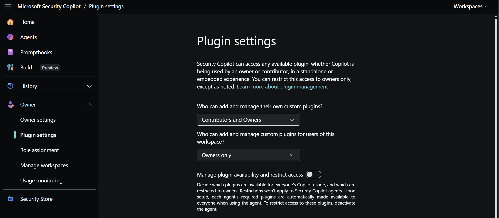

[🏠 전체 목차](./README.md)　·　**Part 2 · 핵심 기능**　·　페이지 6 / 12

# 05 · 플러그인 (Microsoft · 비-Microsoft · 커스텀)

> [!NOTE]
> **이 페이지에서 얻는 것**
> - Microsoft·비-Microsoft·커스텀 플러그인의 차이
> - 플러그인이 응답 품질에 미치는 영향(그라운딩)
> - 조직 단위 접근 제어와 관리 방법
>
> ⏱️ 예상 소요 **7분**　·　🎯 대상: 보안/IT 관리자

플러그인(plugin)은 API를 통해 Microsoft·비-Microsoft 서비스 및 공개 웹의 리소스에 접근하게 하여 Security Copilot의 기능을 확장하는 **관련 도구(tool)의 모음**입니다. 플러그인은 응답에 컨텍스트를 추가하며, 에이전트의 경우 LLM 범위를 넘어 에이전트가 수행할 수 있는 작업을 확장합니다.

---

## 1. 플러그인 유형 (4종)


| 유형 | 설명 |
| --- | --- |
| **Microsoft 플러그인** | 사전 설치됨. 온-비할프(on-behalf-of) 인증 사용. 조직 라이선스에 따라 자동으로 제공. 데이터 접근에는 적절한 서비스 역할 필요. |
| **비-Microsoft(3rd-party) 플러그인** | 사전 설치됨. 일부는 사용자별 인증 설정 필요. 예시는 아래 참조. |
| **공개 웹(Public web)** | 공개 웹 검색에 대한 접근을 제공. |
| **커스텀(Custom) 플러그인** | 소유자/기여자가 생성. `.yaml` 또는 `.json` 파일로 업로드(Security Copilot 플러그인 또는 OpenAI 플러그인 형식). 개인 사용자 또는 조직 전체 범위로 설정 가능. |

## 2. 주요 Microsoft 플러그인

- Microsoft Defender XDR
- Microsoft Sentinel
- Microsoft Entra
- Microsoft Intune
- Microsoft Purview
- Microsoft Threat Intelligence (MDTI)
- Natural Language to KQL (고급 헌팅용, NL2KQL)
- Microsoft Defender for Cloud
- Azure Firewall
- Microsoft Defender External Attack Surface Management (EASM)

> [!IMPORTANT]
> 플러그인으로 Security Copilot과 통합되는 제품은 **별도로 구매하여 라이선스를 보유한 상태** 여야만 사용 가능합니다.

## 3. 비-Microsoft 플러그인

비-Microsoft(3rd-party) 플러그인은 **다수가 사전 설치**되어 제공되며, 위협 인텔리전스·네트워크·엔드포인트·IT 서비스 관리 등 다양한 영역을 아우릅니다. 전체 목록은 [공식 문서](https://learn.microsoft.com/en-us/copilot/security/plugin-other)를 참고하세요. 대표 예시는 다음과 같습니다.

- AbuseIPDB
- GreyNoise
- Shodan
- ServiceNow (SIR)
- Splunk
- Tanium

> [!NOTE]
> 위 목록은 대표 예시일 뿐이며, 이 외에도 Censys, Darktrace, Netskope, ReversingLabs, UrlScan 등 다수의 비-Microsoft 플러그인이 존재합니다. 일부 플러그인은 사용자별 인증 설정이 필요합니다.

## 4. 커스텀 플러그인

사전 제공되는 플러그인만으로 부족할 때, 조직 고유의 워크플로나 내부 시스템에 맞춰 **직접 만들어 등록하는 플러그인**입니다. 매니페스트 파일 하나(스킬의 이름·입력값·동작 방식을 정의)를 작성해 업로드하면 되며, 외부 API를 호출하는 유형부터 모델에게 지시만 내리는 GPT 유형까지 다양하게 구성할 수 있습니다.

- **파일 형식:** `.yaml` 또는 `.json`
- **지원 형식:** Security Copilot 플러그인 형식 또는 OpenAI 플러그인 형식
- **생성 주체:** 소유자(owner) 또는 기여자(contributor)
- **범위:** 개인 사용자 또는 조직 전체

### 매니페스트 파일 형식

커스텀 플러그인은 아래처럼 **스킬의 이름·설명·입력값·동작**을 정의하는 매니페스트로 구성됩니다. 다음은 Microsoft 커뮤니티 샘플인 [Redact PII](https://github.com/Azure/Security-Copilot/tree/main/Plugins/Community%20Based%20Plugins/Redact%20PII)의 매니페스트를 축약한 예시입니다.

```yaml
Descriptor:
  Name: RedactPIIGPT
  DisplayName: Redact PII Skillset
  Description: A GPT-based skillset for redacting PII from text/prompt output

SkillGroups:
  - Format: GPT                      # 외부 소스·인증 없이 모델만으로 동작
    Skills:
      - Name: RedactPII
        DisplayName: Redact PII
        Description: Redacts Personally Identifiable Information (PII) from the provided text
        Inputs:
          - Name: text               # 프롬프트에서 넘겨받는 입력값
            Description: The text that may contain PII to be redacted
        Settings:
          ModelName: gpt-4o
          Template: |-               # 모델에게 내리는 지시 프롬프트
            ... 이메일·전화번호·SSN·주소·IP 등 PII를 찾아 가려라 ...
            {{text}}
```

작성한 매니페스트는 **Sources(플러그인) → Add plugin → Custom → 파일 업로드**로 등록하면 프롬프트에서 바로 호출할 수 있습니다.

### 이런 것들을 만들어 볼 수 있습니다

- **Redact PII** — 텍스트에서 이메일·전화번호·IP 등 개인식별정보를 가림 (위 예시, 외부 연동 불필요)
- 내부 위협 인텔·자산 DB 등 **사내 시스템 조회**를 자연어로 감싸는 플러그인
- 사내 표준 양식에 맞춘 **리포트·티켓 자동 생성** 플러그인

> [!NOTE]
> 커뮤니티 플러그인은 Microsoft 공식 지원 대상이 아니므로 도입 전 내용을 검토하세요. GPT 유형은 결정론적이지 않으므로, 규정 준수가 중요한 결과는 사람이 최종 확인하는 것이 좋습니다.

## 5. 플러그인 관리


*Owner → Plugin settings — 커스텀 플러그인 관리 권한과 플러그인 가용성/접근 제한을 구성합니다.*

소유자(Owner)는 **Owner → Plugin settings** 에서 플러그인 권한을 관리합니다. 기본적으로 Security Copilot은 소유자·기여자가 standalone·embedded 어느 경험에서든 사용 가능한 모든 플러그인에 접근할 수 있으며, 이를 소유자 전용으로 제한할 수 있습니다.

- **내 커스텀 플러그인 관리 권한:** 자신의 커스텀 플러그인을 추가·관리할 수 있는 대상을 지정합니다(*Contributors and Owners* 또는 *Owners only*).
- **워크스페이스 사용자용 커스텀 플러그인 관리 권한:** 이 워크스페이스 사용자 전체를 위한 커스텀 플러그인을 관리할 수 있는 대상을 지정합니다(기본 *Owners only*).
- **플러그인 가용성/접근 제한(토글):** 어떤 플러그인을 전체 사용자에게 열고 어떤 것을 소유자 전용으로 제한할지 결정합니다.

> [!NOTE]
> 이 접근 제한은 **Security Copilot 에이전트에는 적용되지 않습니다.** 에이전트를 설정하면 필요한 플러그인이 해당 에이전트 사용 시 모든 사용자에게 자동 제공되며, 이를 막으려면 에이전트를 비활성화(deactivate)해야 합니다.

---

## 참고 링크

- [플러그인 개요](https://learn.microsoft.com/en-us/security-copilot/plugin-overview)
- [플러그인 관리](https://learn.microsoft.com/en-us/security-copilot/manage-plugins)
- [비-Microsoft 플러그인](https://learn.microsoft.com/en-us/security-copilot/plugin-other)
- [Security Copilot 커뮤니티·샘플 플러그인 (GitHub: Azure/Security-Copilot)](https://github.com/Azure/Security-Copilot/tree/main/Plugins)

---

### 다음 읽을거리

| ◀ 이전 | ▶ 다음 |
| :-- | --: |
| [04 · 프롬프트북](./04-promptbooks.md) | [06 · 임베디드 경험](./06-embedded-experiences.md) |

[🏠 전체 목차로 돌아가기](./README.md)
