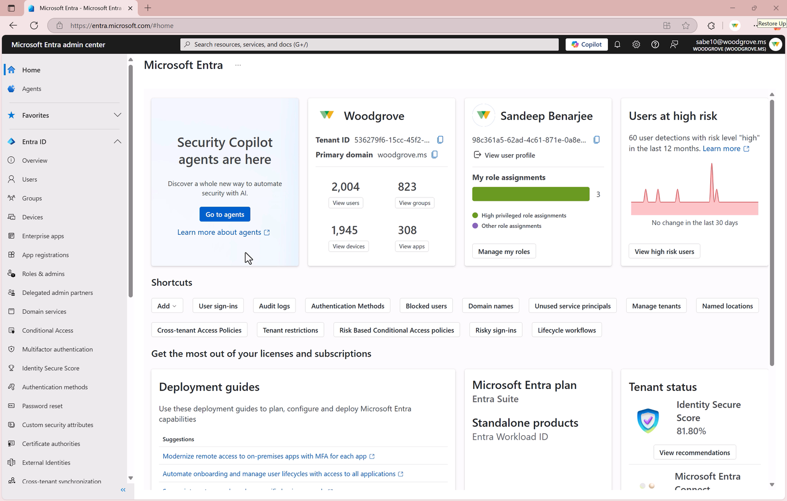
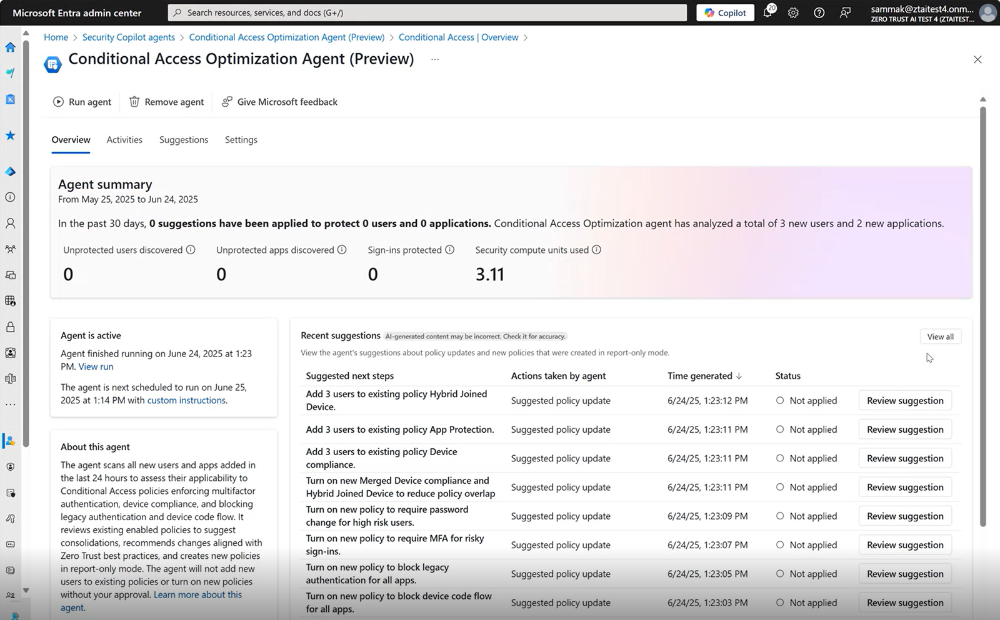
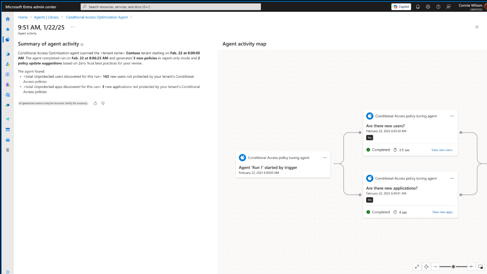
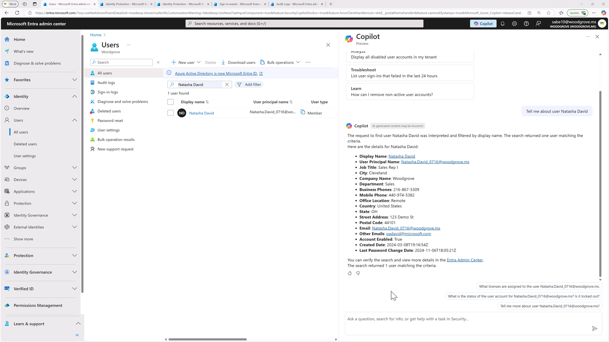
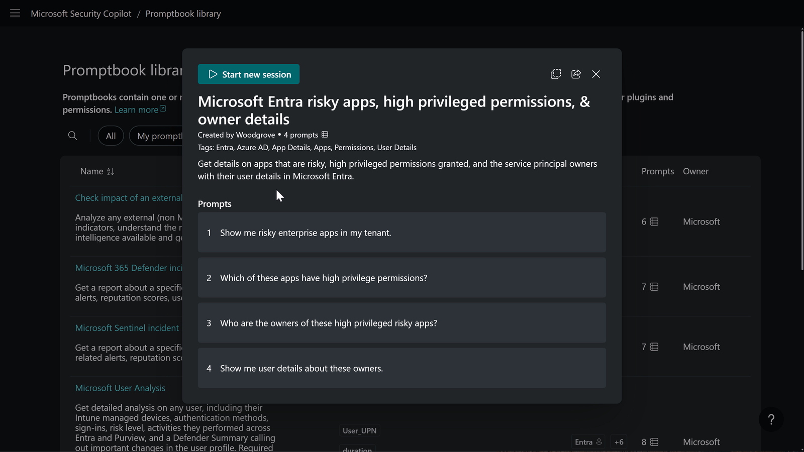

[🏠 전체 목차](./README.md)　·　**Part 2 · 핵심 기능**　·　07 · 에이전트 › Entra

# 07a · Microsoft Entra 에이전트

> [!NOTE]
> **이 페이지에서 얻는 것**
> - ID·액세스(IAM) 업무를 Security Copilot 에이전트로 어디까지 자동화할 수 있는지
> - Entra 에이전트의 역할·자동화 범위·GA/프리뷰 상태
> - 조건부 액세스(CA) 최적화 에이전트의 실제 UI 화면과 동작 방식
>
> ⏱️ 예상 소요 **7분**　·　🎯 대상: ID 보안 관리자, IAM 담당, 보안/IT 관리자

ID는 오늘날 공격의 최전선입니다. Entra의 Security Copilot 에이전트는 **조건부 액세스 정책 유지·위험 사용자 조사** 같은 고빈도 IAM 업무를 자율·적응형으로 자동화해, 관리자가 전략적 업무에 집중하게 합니다.

*Microsoft Entra 관리 센터에서 바로 접근하는 Security Copilot 에이전트*

> [!IMPORTANT]
> **전통적 자동화 vs 에이전트** — 규칙 기반 자동화는 고정적이라 새 사용자·앱·조건이 등장하면 사각지대가 생깁니다. Security Copilot 에이전트는 **맥락을 이해하고 변화에 적응하며 지속 학습**하므로, 위협·IT 환경이 진화해도 견고합니다.

---

## 1. Conditional Access Optimization Agent — 조건부 액세스 자동 최적화 (GA)

조직이 성장하면 새 사용자·앱이 계속 추가되고, 조건부 액세스(CA) 정책은 금방 뒤처집니다. 이 에이전트는 테넌트를 **상시 스캔**해 정책 공백을 찾아내고, **원클릭 개선안**을 제시합니다.

- **지속적으로 공백 발견:** **24시간 주기**로 새 사용자·앱을 모니터링해, 취약점이 되기 전에 CA 정책과의 불일치를 탐지합니다.
- **원클릭 개선:** 수동 조사 없이 명확·실행 가능한 권장을 제시하고, 클릭 한 번으로 정책 공백을 닫습니다.
- **환경 변화에 적응:** 사용자·앱·조건이 바뀌어도 CA 정책을 계속 정렬 상태로 유지 — 주기적 감사 의존을 줄이고 매일 보안을 강화합니다.

*첫 실행 후 대시보드 — 보호된 사용자·앱, 권장 정책 업데이트를 한눈에*

**GA로 강화된 점:**

- **자연어 설명 + 활동 맵:** 각 제안에 대해 평문 요약과 **시각적 활동 맵**을 제공해, 에이전트가 어떤 데이터를 보고 어떤 논리로 결론에 이르렀는지 보여줍니다 — 신뢰·투명성 확보.
- **위험 기반 정책 권장:** 사용자 위험·로그인 위험을 반영해, 기존에 누락됐거나 새로 추가된 사용자까지 **위험 기반 CA 정책**으로 보호합니다.
- **감사 로깅:** 설치·시작/중지·활성/비활성 등 에이전트 활동을 감사 로그에 기록 — 가시성과 컴플라이언스 보고가 쉬워집니다.

*에이전트가 제안에 이른 과정을 보여 주는 활동 맵 — "왜 이 정책인가"를 설명*

> [!TIP]
> **왜 좋아하나 (고객 사례)** — "24/7 대기하는 보안 분석가처럼, CA 정책의 공백을 선제적으로 찾아 첫날부터 모든 사용자를 보호한다. 리포트 전용(report-only) 모드와 AI 권장으로 중단 없이 정책을 테스트·개선할 수 있다." *(Microsoft MVP)* — 첫 실행부터 가치를 내며, 수 주가 걸리던 수동 검토를 대체합니다.

## 2. Identity Risk Management Agent — 위험 사용자 조사 자동화 (Preview)

Entra ID Protection이 표시한 **위험 사용자**를 관리자가 조사·평가·대응하도록 지원하는 에이전트입니다.

- **위험 사용자 심층 분석:** 왜 위험한지, 어떤 활동이 근거인지 자연어로 요약합니다.
- **영향 평가·보호 조치:** 계정 상태·인증 수단·로그인 이력을 종합해 조치를 제안합니다.
- **유연한 실행:** **24시간 주기** 실행, 수동 트리거, 연속 모니터링을 지원합니다.

*Entra 관리 센터에서 위험 사용자를 선택하면 Copilot이 위험 근거·조치를 제시*

> [!NOTE]
> 위 에이전트 외에도, Entra에는 **임베디드 Security Copilot(어시스티브)** 기능이 있습니다 — 로그인 로그 문제 해결, 위험 사용자 요약, 앱(워크로드 ID) 위험 조사, 라이프사이클 워크플로 관리, 프롬프트북 기반 심층 분석 등. 관리자가 페이지를 옮겨 다니며 **사이드카 Copilot 채팅**으로 조사를 이어갈 수 있습니다.

*"위험한 앱·고권한·소유자" 프롬프트북 — 반복 조사를 재사용 가능한 워크플로로*

---

> [!TIP]
> **자동화 성숙도 관점** — Entra 에이전트는 **예방·태세 유지**에 강합니다. CA 최적화 에이전트가 정책 공백을 상시 닫아 제로 트러스트를 스케일러블하게 유지하고, Identity Risk Management 에이전트가 위험 사용자 대응을 가속합니다. 두 에이전트 모두 **사람 감독 하의 반자동**으로, 원클릭 실행·자연어 설명으로 통제권을 관리자에게 둡니다.

## 참고 링크

- [Entra 에이전트](https://learn.microsoft.com/entra/security-copilot/entra-agents)
- [Conditional Access Optimization Agent](https://learn.microsoft.com/entra/identity/conditional-access/agent-optimization)
- [Entra의 Security Copilot 개요](https://learn.microsoft.com/entra/fundamentals/copilot-security-entra)
- [에이전트 개요](https://learn.microsoft.com/security-copilot/agents-overview)

---

### 다음 읽을거리

| ◀ 이전 | ▶ 다음 |
| :-- | --: |
| [07 · 에이전트 개요](./07-agents.md) | [07b · Intune 에이전트](./07b-intune-agents.md) |

[🏠 전체 목차로 돌아가기](./README.md)
