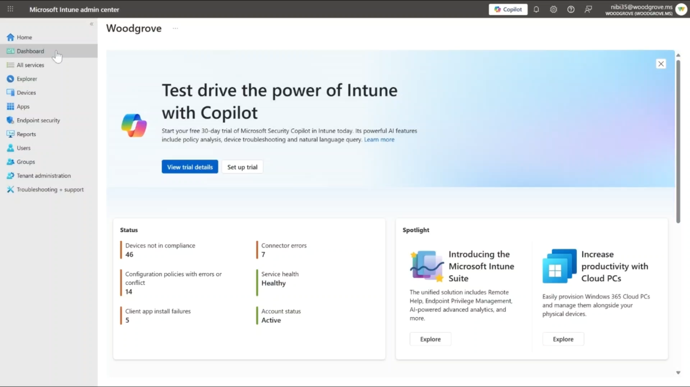
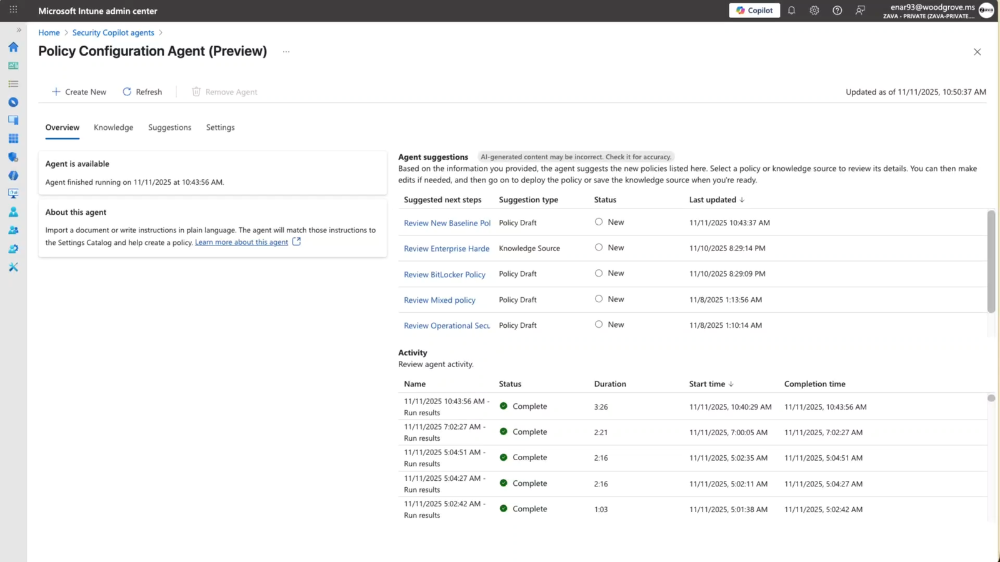
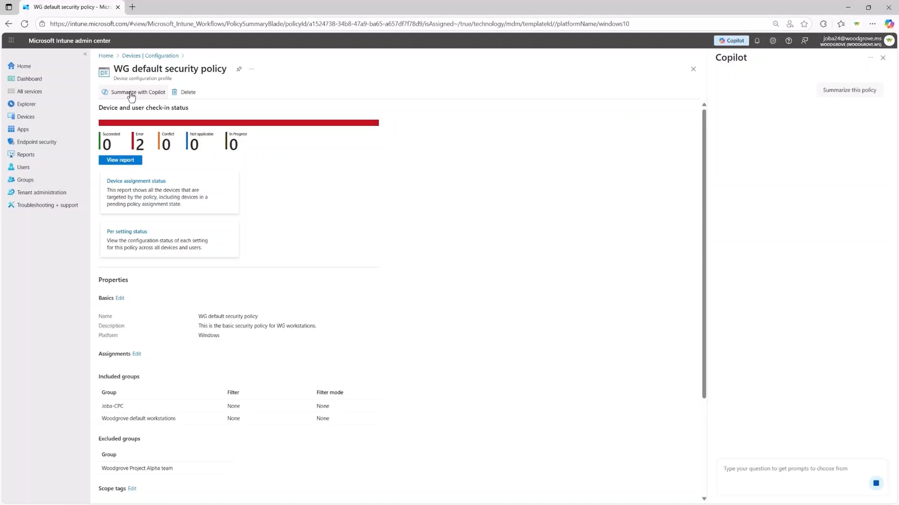
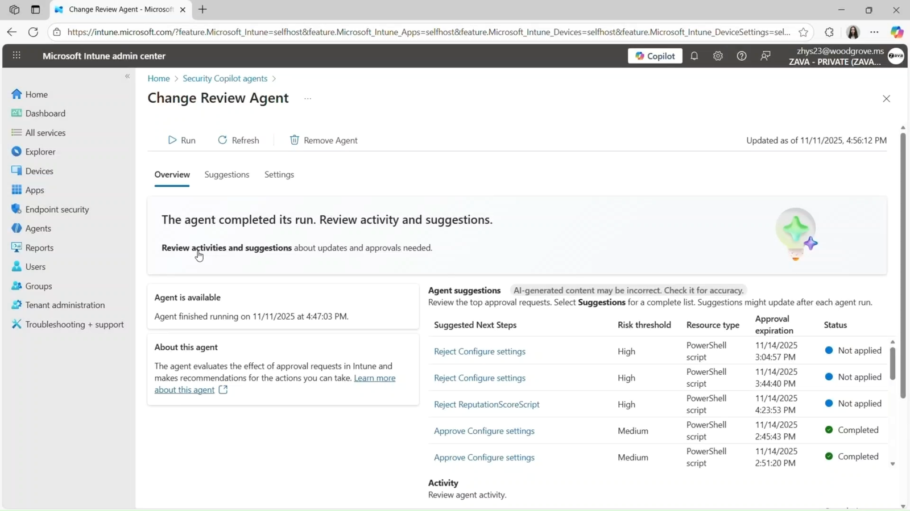
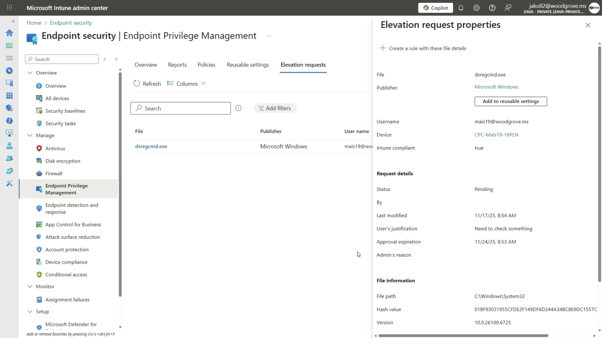

[🏠 전체 목차](./README.md)　·　**Part 2 · 핵심 기능**　·　07 · 에이전트 › Intune

# 07b · Microsoft Intune 에이전트

> [!NOTE]
> **이 페이지에서 얻는 것**
> - 엔드포인트 관리 업무를 Security Copilot 에이전트로 어디까지 자동화할 수 있는지
> - Intune 에이전트의 역할·자동화 범위·GA/프리뷰 상태
> - 변경 검토·정책 구성·취약점 개선 에이전트의 실제 UI 화면
>
> ⏱️ 예상 소요 **7분**　·　🎯 대상: 엔드포인트/IT 관리자, 보안 관리자

IT 관리자의 모든 변경은 환경 전반에 파급됩니다. Intune의 Security Copilot 에이전트는 **변경 영향 분석·정책 구성·취약점 개선**을 자동화해, 더 안전한 결정을 더 빠르게 내리도록 돕습니다.

*Microsoft Intune 관리 센터에 통합된 Security Copilot*

---

## 1. Policy Configuration Agent — 정책 구성 자동화 (GA)

Intune 정책은 설정 하나하나가 보안·생산성·컴플라이언스를 좌우합니다. 이 에이전트는 **자연어 입력**을 실제 구성으로 번역합니다.

- **정책 의도 이해:** 조직 요구사항을 명확·실행 가능한 구성으로 번역합니다.
- **설정 생성 지원:** 일치하는 **설정 카탈로그(Settings Catalog)** 설정을 찾아 값을 권장하고, 구성 방법을 안내합니다.
- **지식 소스 재사용:** 문서를 업로드하면 관련 설정 매핑을 식별하고, 이를 **지식 소스로 저장**해 이후 정책에 재사용합니다.

*정책 구성 에이전트 — 제안 설정·활동·승인 흐름*

> [!TIP]
> **컴플라이언스 자동화** — PCI·HIPAA·DISA STIG 등 규제 프레임워크를 다루는 조직이라면, 이 에이전트가 표준 정렬을 자동화하고 환경을 지속 감사해 **규정 이탈을 위험이 되기 전에 플래그**합니다. 집중적인 수동 검토 없이 안전·준수 태세를 민첩하게 유지합니다.

*보안 설정 정책 편집 화면에 통합된 Copilot 안내*

## 2. Change Review Agent — 변경 영향 검토 자동화 (Preview)

앱 배포부터 정책 업데이트까지, 작은 변경도 환경에 파장을 남깁니다. 이 에이전트는 각 변경을 **맥락 속에서 분석**합니다.

- **요청된 변경 분석:** 각 변경을 위험·충돌·컴플라이언스 관점에서 검토합니다.
- **깊은 이해 제공:** 그 변경이 환경에 미칠 영향을 상세히 설명합니다.
- **정보 기반 결정:** 명확한 권장을 제시해, 확신을 가지고 승인/반려할 수 있게 합니다.

*변경 검토 에이전트 — 위험·영향 분석과 승인/반려 권장*

## 3. Vulnerability Remediation Agent — 취약점 개선 자동화 (GA)

취약점은 양도 많고 긴급성 판단도 어렵습니다. 이 에이전트는 **탐지·위험 평가·개선**을 자동화합니다.

- **진화하는 위협 지속 탐지:** **90일**에 걸쳐 취약점을 모니터링·재평가하며, 새로 부상하는 위협을 식별합니다.
- **중요 패치 우선순위화:** Defender 데이터를 활용해 AI로 영향을 분석하고, 즉시 조치가 필요한 취약점을 판별합니다.
- **맥락과 함께 신속 개선:** 긴급성의 근거를 명확히 제시해, 불필요한 중단 없이 빠르고 정보 기반의 개선을 가능케 합니다.

> [!NOTE]
> Vulnerability Remediation Agent는 Intune·Defender 데이터를 함께 활용합니다. 취약점 발견 → AI 위험 평가 → 개선 우선순위·패치 제안까지 이어지는 과정을 자동화해, 여전히 수동에 머무는 "위험 평가·우선순위화" 단계를 대체합니다.

---

## 임베디드 기능: Endpoint Privilege Management(EPM)

에이전트 외에도, Intune에는 어시스티브 임베디드 Copilot이 있습니다. 대표적으로 **Endpoint Privilege Management(EPM)**의 승인 워크플로에서, 앱 권한 상승 요청의 **잠재적 위험을 식별**해 관리자의 승인 판단을 돕습니다.

*엔드포인트 권한 관리 — 권한 상승 요청의 위험을 Copilot이 평가*

> [!TIP]
> **자동화 성숙도 관점** — Intune 에이전트는 엔드포인트 라이프사이클의 **구성·변경·취약점 관리**를 커버합니다. Policy Configuration이 "무엇을 어떻게 설정할지"를, Change Review가 "이 변경이 안전한지"를, Vulnerability Remediation이 "무엇을 먼저 고칠지"를 자동화합니다. 모두 **사람 감독 하의 반자동**으로, 관리자가 최종 승인권을 갖습니다.

## 참고 링크

- [Intune 에이전트](https://learn.microsoft.com/intune/intune-service/copilot/security-copilot-agents-intune)
- [Intune의 Security Copilot 개요](https://learn.microsoft.com/intune/intune-service/copilot/security-copilot)
- [에이전트 개요](https://learn.microsoft.com/security-copilot/agents-overview)

---

### 다음 읽을거리

| ◀ 이전 | ▶ 다음 |
| :-- | --: |
| [07a · Entra 에이전트](./07a-entra-agents.md) | [07c · Purview 에이전트](./07c-purview-agents.md) |

[🏠 전체 목차로 돌아가기](./README.md)
