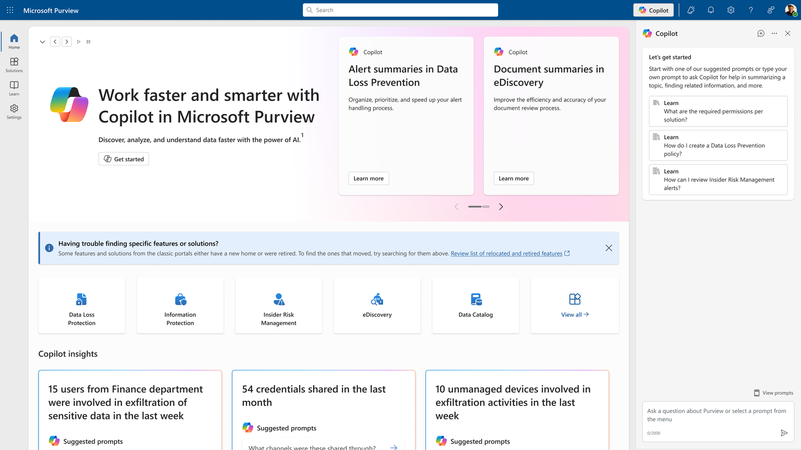
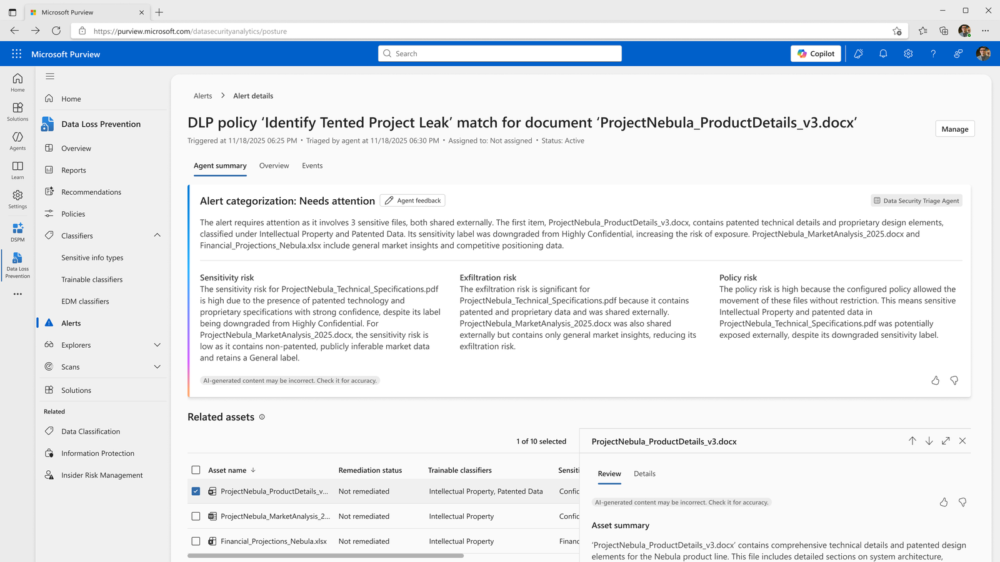
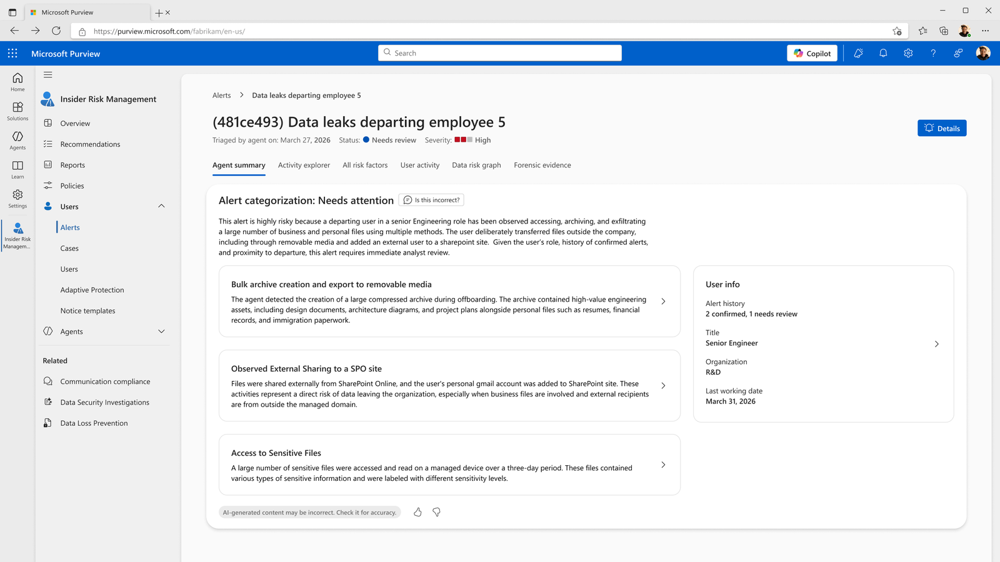
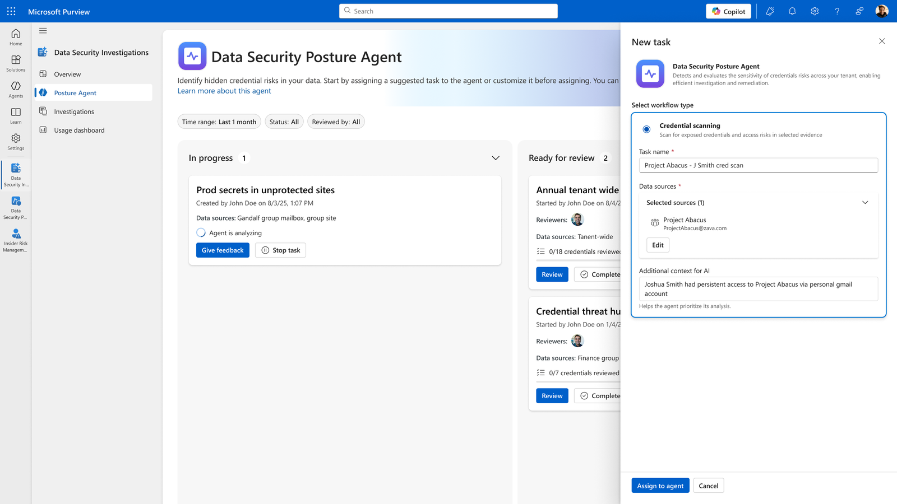
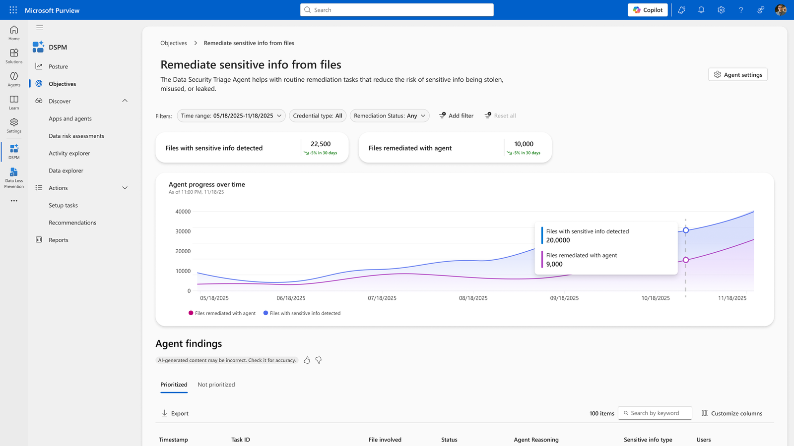
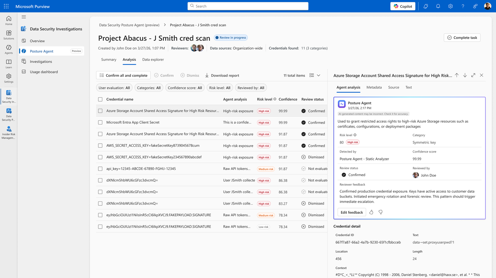

[🏠 전체 목차](./README.md)　·　**Part 2 · 핵심 기능**　·　07 · 에이전트 › Purview

# 07c · Microsoft Purview 에이전트

> [!NOTE]
> **이 페이지에서 얻는 것**
> - 데이터 보안·컴플라이언스 업무를 Security Copilot 에이전트로 어디까지 자동화할 수 있는지
> - Purview 에이전트의 역할·자동화 범위·GA/프리뷰 상태
> - 경보 분류(Triage)·데이터 태세(Posture) 에이전트의 실제 UI 화면
>
> ⏱️ 예상 소요 **8분**　·　🎯 대상: 데이터 보안 담당, 컴플라이언스, 인사이더 리스크 분석가

데이터 보안팀은 **하루 평균 66건**의 경보를 받지만 실제로는 **63%만** 검토합니다. Purview의 Security Copilot 에이전트는 경보 분류와 민감 데이터 발견을 자율 자동화해, 가장 중요한 위험을 먼저 다루도록 돕습니다.

*Microsoft Purview에 통합된 Security Copilot — DLP·eDiscovery 요약 등*

---

## 1. Triage Agent — 경보 분류·우선순위 자동화

DLP와 IRM 각각에 제공되는 분류 에이전트로, **가장 위험이 큰 경보를 먼저** 처리하도록 에이전트 관리형 경보 큐를 만듭니다. 경보를 네 가지 범주(**All / Needs attention / Less Urgent / Not categorized**)로 분류합니다.

*DLP 정책 매치 경보를 "주의 필요"로 분류하고 근거를 제시*

### Triage Agent in Data Loss Prevention (DLP) — (GA)
- **콘텐츠 위험 중심 판정:** 정책에 정의된 **SIT(민감 정보 유형)·학습 가능 분류자·민감도 레이블**을 1차 기준으로 봅니다. 이어 **외부 공유(반출) 위험**, **정책 위험**(모드·규칙 액션), 레이블 제거/강등을 평가합니다.
- **자연어 사용자 지정 지침:** "세금·재무·법무 관련 경보는 우선순위 높게", "PDF/JPG 자산은 낮게" 같은 지침을 **구조화된 분류 로직으로 번역**해 우선순위를 올리거나 내립니다. *(DLP 전용)*
- **자동 개선:** 문서 소유자에게 **Teams로 연락**해 파일 내 민감 정보 제거를 유도하는 등, 경보 개선까지 자동화할 수 있습니다.

### Triage Agent in Insider Risk Management (IRM) — (GA)
- **행위·사용자 위험 중심 판정:** 반출 위험이 높은 활동과 과거 경보 이력(**활동 위험**), 우선 사용자 그룹 소속·활성 케이스 수(**사용자 위험**)를 평가합니다.
- **심층 분석:** 경보에 연관된 사용자의 **최근 활동 이벤트 3만 건**을 분석하며, 정책에 매칭된 활동뿐 아니라 모든 활동을 평가합니다.
- **풍부한 근거:** 위험 패턴·관련 민감 데이터·행위자·타임프레임을 담은 **에이전트 요약**을 제공합니다.

*IRM 경보를 자동 분류하고 위험 패턴을 자연어로 요약*

> [!IMPORTANT]
> **DLP와 IRM은 판정 기준이 다릅니다.** DLP는 "**무엇이(어떤 민감 콘텐츠가)**" 위험한지를, IRM은 "**누가 어떤 행동을**" 위험하게 했는지를 봅니다. 둘 다 점수가 아니라 **카테고리**로 분류하며, **자연어 사용자 지정 지침은 공식적으로 DLP 전용**입니다.

## 2. Data Security Posture Agent — 민감 데이터 발견·태세 자동화

키워드·정규식이 아니라 **LLM 기반 자연어(의도)** 로 민감 데이터와 노출된 시크릿을 대규모로 발견합니다. 현재 **데이터 발견**과 **자격 증명 스캔** 두 기능을 제공합니다.

### 데이터 발견 — DSPM(Data Security Posture Management) (Preview)
DSPM의 **Asset explorer**에서 시작합니다. 명시적 키워드가 없어도 의도에 맞는 콘텐츠(문서·이메일·메시지·Copilot 채팅)를 M365 전반에서 매칭하고, 적용된 레이블·경로·최종 수정 시각과 함께 위험을 요약합니다.

*DSPM 자산 스캔 — 자연어 의도로 민감 데이터를 발견하고 검토 대상화*

*발견된 민감 파일에 대해 레이블 적용 등 개선 진행 상황을 추적*

### 자격 증명 스캔 — DSI(Data Security Investigations) (Preview)
**Data Security Investigations**에서 자격 증명 스캔 작업을 만들어, 특정 사이트를 스코프로 파일 속 **비밀번호·API 키·시크릿**을 탐지합니다. 자연어로 맥락을 좁혀("이 사용자가 숨긴 자격 증명을 찾아줘") 대규모로 노출 자격 증명을 발견합니다.

*Data Security Investigations의 자격 증명 스캔 — 노출된 시크릿을 대규모 탐지*

> [!TIP]
> **발견 → 개선 → 심층 조사** — Posture 에이전트에서 발견한 결과는 레이블 변경·보고 같은 즉시 조치로 이어지거나, 증거가 충분하면 **Data Security Investigations·eDiscovery**로 넘겨 심층 분석할 수 있습니다.

---

> [!TIP]
> **자동화 성숙도 관점** — Purview 에이전트는 데이터 보안 라이프사이클의 **발견·분류·대응**을 커버합니다. Triage 에이전트가 "어떤 경보를 먼저" 볼지 자동 판정하고, Posture 에이전트가 "민감 데이터·시크릿이 어디 있는지"를 자연어로 발견합니다. 모두 SCU를 소비하며 **사람 감독 하의 반자동**으로 동작합니다.

## 참고 링크

- [Purview 에이전트 개요](https://learn.microsoft.com/purview/copilot-in-purview-agents-overview)
- [DLP 분류 에이전트 시작](https://learn.microsoft.com/purview/copilot-in-purview-triage-dlp-agent-get-started)
- [IRM 분류 에이전트 시작](https://learn.microsoft.com/purview/copilot-in-purview-triage-irm-agent-get-started)
- [Purview의 Security Copilot](https://learn.microsoft.com/purview/copilot-in-purview-overview)

---

### 다음 읽을거리

| ◀ 이전 | ▶ 다음 |
| :-- | --: |
| [07b · Intune 에이전트](./07b-intune-agents.md) | [07d · Defender 에이전트](./07d-defender-agents.md) |

[🏠 전체 목차로 돌아가기](./README.md)
