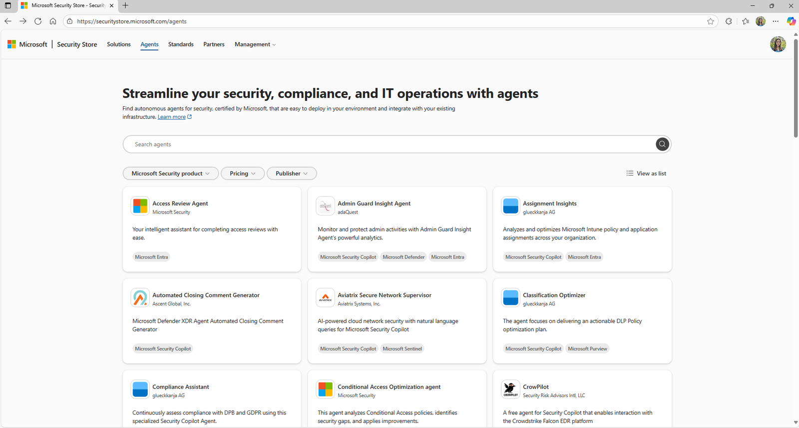
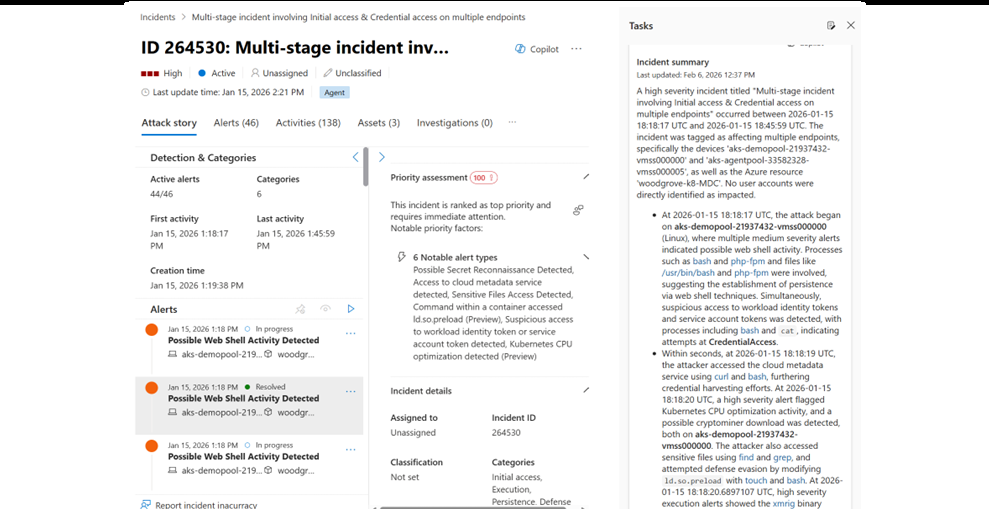
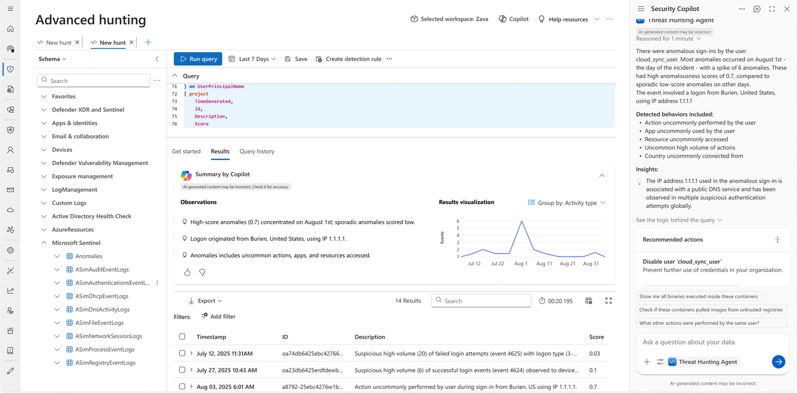
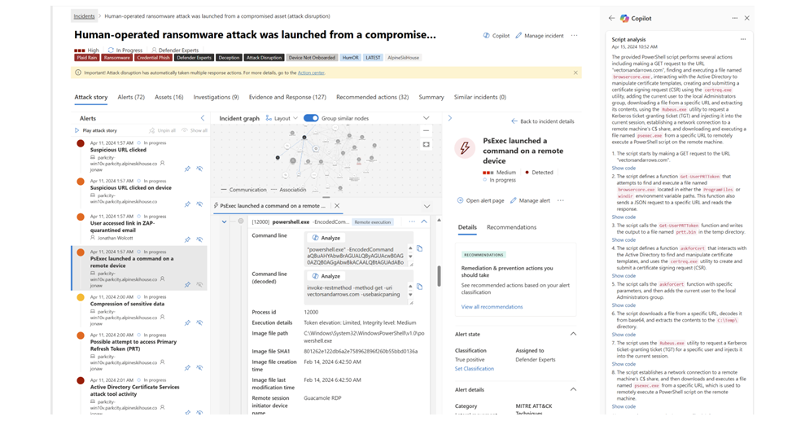
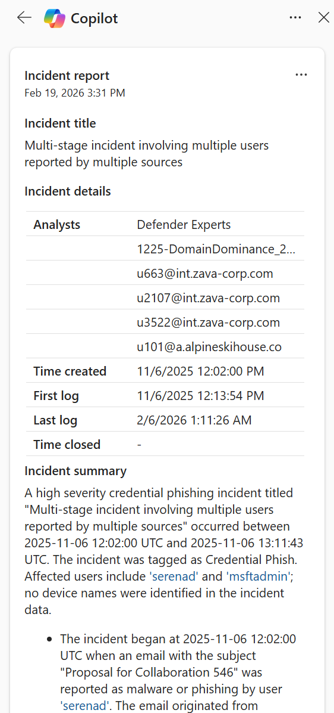

[🏠 전체 목차](./README.md)　·　**Part 2 · 핵심 기능**　·　07 · 에이전트 › Defender

# 07d · Microsoft Defender 에이전트

> [!NOTE]
> **이 페이지에서 얻는 것**
> - SOC(보안 관제) 업무를 Security Copilot 에이전트로 어디까지 자동화할 수 있는지
> - Defender에 포함된 5종 에이전트의 역할·자동화 범위·GA/프리뷰 상태
> - 실제 UI 화면으로 보는 분류(Triage)·헌팅·위협 인텔리전스 자동화
>
> ⏱️ 예상 소요 **8분**　·　🎯 대상: SOC 분석가, 위협 헌터, 탐지 엔지니어, SOC 매니저

[07 · 에이전트](./07-agents.md) 개요에서 봤듯이, Defender의 Security Copilot은 **어시스티브(assistive)**와 **자율(autonomous)** 두 층으로 나뉩니다. 이 페이지는 그중 **자율 층 = 에이전트**에 집중합니다. 에이전트는 사람의 감독 아래 대량의 반복 보안 업무를 스스로 수행해, 분석가가 **진짜 위협에 집중**하도록 돕습니다.

*Defender 포털의 에이전트 카탈로그 — Microsoft·파트너 에이전트를 한곳에서 검색·배포*

> [!TIP]
> **왜 에이전트인가 — 실측 효과(피싱 분류 에이전트 기준)**
> - 전문 인력 대비 악성 경보를 **6.5배** 더 많이 식별
> - 판정 정확도 **77%** 향상
> - 분석가가 악성 경보 조사에 쓰는 시간 **53%** 증가(노이즈 대신 진짜 위협에 집중)
> - 한 의료기관(St. Luke's)은 수천 건의 오탐을 자율 종결해 **월 200시간** 절감
>
> *출처: Microsoft Research, Phishing Triage Agent 무작위 대조 시험(RCT).*

---

## 1. Security Alert Triage Agent — 경보 분류 자동화 (Preview)

SOC가 매일 받는 수백~수천 건의 경보 중 상당수는 오탐입니다. **Security Alert Triage Agent**는 **피싱(이메일·협업), ID, 클라우드** 경보를 대상으로, 각 경보가 실제 위협인지 오탐인지 **자율적으로 판정**합니다.

- **정교한 자율 판정:** 경보마다 다단계 추론을 적용해 진짜 위협/오탐을 높은 정밀도로 구분합니다.
- **완전한 투명성:** 판정 근거를 자연어로 설명하고, 결론에 이르기까지 밟은 단계를 **시각적으로 매핑**합니다. 분석가는 필요 시 판정을 조정할 수 있습니다.
- **피드백으로 진화:** 자연어 피드백을 학습해 정확도를 계속 높입니다 — 통제권은 항상 팀에 있습니다.

*다단계 인시던트의 경보를 자동 분류하고 우선순위·판정 근거를 제시*

> [!NOTE]
> 이 에이전트는 원래 **Phishing Triage Agent**로 출발했으며, 현재 **ID·클라우드 경보**까지 확장됐습니다. **이메일/협업 경보 분류는 GA**, **ID·클라우드 경보 분류는 프리뷰**로 제공됩니다.

## 2. Security Analyst Agent — 심층 조사 자동화 (GA)

단순 쿼리를 넘어 **실제 조사**를 수행하는 에이전트입니다. Defender XDR·Sentinel의 신호를 연결해, 전통적 방식으로는 놓치기 쉬운 위험을 다단계로 분석합니다.

- **방대한 텔레메트리 → 답:** 대량의 보안 데이터를 몇 분 만에 분석해 **가장 위험이 높은 발견**을 신뢰 가능한 증거와 함께 제시합니다.
- **투명한 결론:** 우선순위가 매겨진 발견마다 추론 과정과 뒷받침 증거를 함께 제공합니다.
- **코드/KQL 불필요:** 이상 탐지·클러스터링·위험 점수화·예측을 즉시 사용 가능한 형태로 수행합니다.

*Advanced Hunting 결과를 Copilot이 요약·해석해 위험 신호를 표면화*

## 3. Threat Hunting Agent — 대화형 위협 헌팅 (Preview)

KQL 전문성이 없어도 **평문(자연어)**으로 위협을 헌팅합니다.

- **자연어 → 실행 가능한 쿼리:** 의도를 바로 실행할 수 있는 쿼리로 번역합니다.
- **가이드형 지원:** 구조화된 후속 질문 제안과 **실행 가능한 개선 권장**을 제공합니다.
- **맥락적 통찰:** 관련 패턴·상관관계를 표면화하고, **시각 그래프**로 해석을 돕습니다.

> 🇰🇷 "지난 일주일 내 위험 세션에 로그인한 모든 디바이스를 찾아줘."
>
> 🇺🇸 *`Find all devices that signed in to a risky session within the last week.`*

## 4. Threat Intelligence Briefing Agent — 위협 인텔 브리핑 자동화 (GA)

조직 고유 프로필에 맞춘 최신 위협 인텔리전스를 **몇 분 만에** 브리핑으로 산출합니다. 사람이 하면 몇 시간~며칠 걸리던 작업입니다.

- **나에게 매핑된 위협:** 지리적 위치·IT 인프라·위협 노출도 등 조직 프로필에 맞춘 인텔을 제공합니다.
- **실시간 상황 인식:** 변화하는 공격 환경과 IT 환경을 지속 학습해 가장 관련성 높은 업데이트를 제공합니다.
- **신속한 리포트:** 수동 인텔 수집·유지 없이 리포트를 자동 생성 — 리더십 공유에 적합합니다.

## 5. Dynamic Threat Detection Agent — 탐지 사각지대 자동 발견 (Preview)

경보·이벤트·이상 징후·위협 인텔을 **상시 상관 분석**하는 백엔드 서비스 에이전트로, **오탐(false negative)과 사각지대**를 찾아냅니다.

- **숨은 위협 선제 발굴:** 인시던트·텔레메트리를 지속 조사해 놓친 위협을 줄이고 태세를 강화합니다.
- **동적 경보 생성:** 사각지대를 발견하면 위험 세부정보·**MITRE ATT&CK 매핑**·개선 권장이 포함된 경보를 동적으로 생성합니다.
- **통합 활동 그래프:** 경보·이상·위협 인텔을 연결한 그래프를 구성해, 개별로는 드러나지 않는 행위를 표면화합니다.

---

## 어시스티브 기능과의 관계

에이전트(자율)와 함께, Defender에는 분석가의 흐름 안에서 동작하는 **어시스티브 임베디드 기능**이 있습니다 — 인시던트/디바이스/ID 요약, 유도된 대응(SOP 반영), 스크립트·파일 분석, 애널리스트 노트 자동 작성, 원클릭 인시던트 리포트 등. 이 기능들의 실습은 [11 · 실무 활용 시나리오 1](./11-use-cases.md)에서 다룹니다.

*인시던트를 열면 Copilot이 공격 스토리·핵심 엔티티·타임라인을 자동 요약*

*조사 종료 후 종합 인시던트 리포트를 원클릭으로 생성*

> [!TIP]
> **자동화 성숙도 관점** — Defender 에이전트는 SecOps 라이프사이클 전반을 커버합니다: 예방(위협 인텔 브리핑) → 탐지·차단(동적 위협 탐지) → 분류·조사(경보 분류·시큐리티 애널리스트·위협 헌팅) → 대응(유도된 대응) → 복구·최적화(인시던트 리포트·애널리스트 노트). 대부분 **사람 감독 하의 반자동**으로 동작하며, 자연어 피드백으로 계속 개선됩니다.

## 참고 링크

- [Defender XDR의 Security Copilot 에이전트](https://learn.microsoft.com/defender-xdr/security-copilot-agents-defender)
- [에이전트 개요](https://learn.microsoft.com/security-copilot/agents-overview)
- [에이전트 검색·배포(Security Store)](https://securitystore.microsoft.com)
- [Defender의 Security Copilot(임베디드)](https://learn.microsoft.com/defender-xdr/security-copilot-in-microsoft-365-defender)

---

### 다음 읽을거리

| ◀ 이전 | ▶ 다음 |
| :-- | --: |
| [07c · Purview 에이전트](./07c-purview-agents.md) | [08 · 사용량 모니터링](./08-usage-monitoring.md) |

[🏠 전체 목차로 돌아가기](./README.md)
