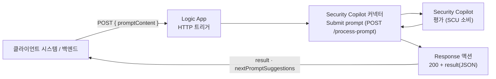
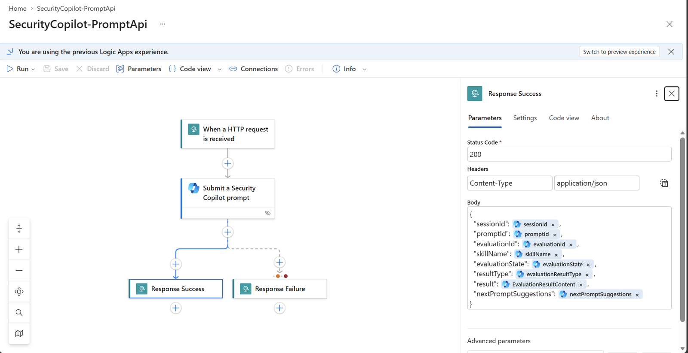
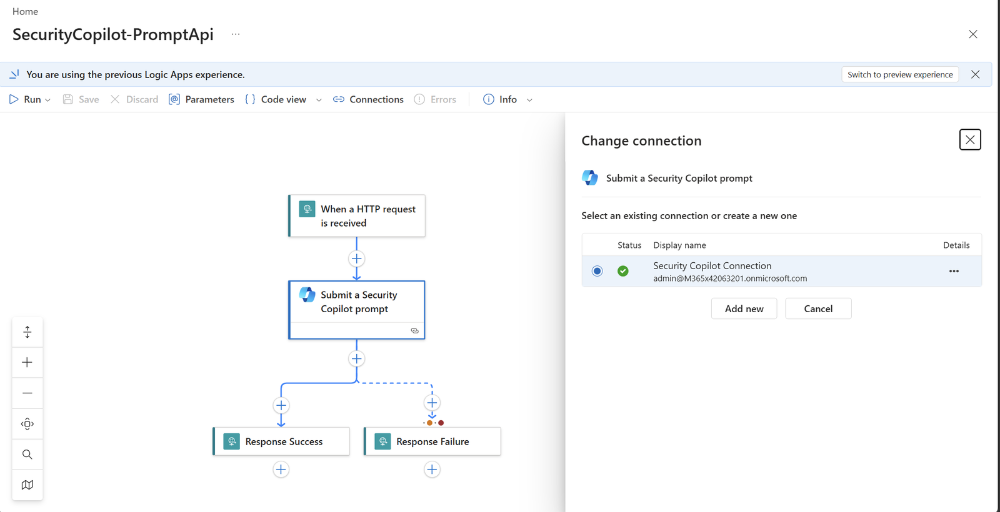

[🏠 전체 목차](./README.md)　·　**Part 2 · 핵심 기능**　·　페이지 9 / 14

# 08 · API 활용

> [!NOTE]
> **이 페이지에서 얻는 것**
> - Security Copilot을 코드/시스템에서 호출해 **자체 시스템·대시보드·티켓·워크플로**에 연동하는 방법
> - 접근 방식 비교 — raw REST가 없고 **Logic Apps 커넥터**가 정답인 이유
> - 실제로 검증한 **구축 레시피**(HTTP 트리거 → Submit prompt → Response)와 요청·응답 원문
>
> ⏱️ 예상 소요 **9분**　·　🎯 대상: 보안 개발자, 자동화 엔지니어, 플랫폼 통합 담당

## 1. 왜 이게 필요한가

Security Copilot의 답변을 **포털 밖에서** 활용하고 싶은 요구가 많습니다 — 예를 들어:

- **자체 보안 대시보드**에 인시던트 요약·위협 인텔을 자동 표시
- **티켓 시스템(Jira·ServiceNow)**에 Copilot 조사 결과를 코멘트로 첨부
- **정기 배치**로 프롬프트북을 실행해 리포트를 생성·배포
- 기존 **SOAR/자동화 파이프라인**에서 자연어 프롬프트를 한 단계로 삽입

이 모든 시나리오의 공통점은 **"프롬프트를 프로그래밍 방식으로 제출하고, 응답을 구조화된 데이터로 받아 다른 시스템에서 재사용"**하는 것입니다.

## 2. 접근 방식 비교

Security Copilot에 프로그래밍 방식으로 접근하는 경로는 여러 가지지만, **프롬프트 제출**이 목적이라면 선택지가 좁습니다.

| 방식 | 프롬프트 제출 | 응답 취득 | 인증 | 상태 | 비고 |
| --- | :--: | :--: | --- | --- | --- |
| **raw REST API** (`POST /prompts`) | — | — | — | **없음** | 프롬프트 제출용 공개 REST API는 **문서화·지원되지 않음** |
| **Export Admin API** (`/exports/*`) | ❌ | ✅ (과거 데이터) | 사용자 / **SPN** | GA | **읽기 전용** — 지난 세션 조회용, 실시간 아님 |
| **Logic Apps 커넥터** | ✅ | ✅ (실시간) | 사용자 / **SPN** | GA | ✅ **권장** — 프롬프트·프롬프트북·에이전트 실행 |
| **Copilot Studio 커넥터** | ✅ | ✅ | 사용자 / SPN | GA | Power Platform 계열 통합에 적합 |
| **MCP 서버** | ❌ | ❌ | 사용자(Entra) | Private Preview | **에이전트 빌드 전용** — 프롬프트 응답 대시보드용 아님 |
| **Microsoft Graph** | ❌ | ❌ | — | 해당 없음 | Graph에는 Security Copilot 네임스페이스가 **없음** |

> [!IMPORTANT]
> **핵심 결론** — 프롬프트를 제출해 실시간 응답을 받는 **문서화·지원되는 유일한 경로는 Logic Apps(및 Copilot Studio) 커넥터**입니다. 커넥터가 감싸는 백엔드 API(`api.securitycopilot.microsoft.com`)를 **직접 호출하는 것은 비문서·비지원**입니다. 커넥터 개요 문서도 "The connectors ... are **a wrapper around the API**"라고 명시합니다.

## 3. 아키텍처

커넥터 액션은 Logic Apps/Power Platform 런타임 안에서만 실행됩니다. 따라서 커넥터를 **HTTP 트리거로 감싸** 여러분만의 REST 엔드포인트로 노출하고, 외부 시스템이 그 URL을 호출하게 합니다. **감싼 Logic App이 곧 여러분 전용 API**가 됩니다.



## 4. 구축 레시피

### 4-1. 워크플로 구성

1. **Logic Apps 리소스** 생성 → 트리거 **"When a HTTP request is received"** (POST).
   - 요청 스키마에 `promptContent`(필수), `sessionId`(선택), `plugins`(선택) 정의.
2. **Security Copilot 커넥터** 액션 **"Submit a Security Copilot prompt"** 추가 → `PromptContent`에 트리거 입력 매핑.
3. **Response 액션**으로 평가 결과(`EvaluationResultContent` 등)를 JSON으로 반환.


*완성된 워크플로 — HTTP 트리거로 시작해 Submit prompt를 거쳐 성공/실패에 따라 Response로 분기. 우측은 Response Success의 본문(응답 필드) 매핑.*

> [!TIP]
> Submit prompt 액션(`/process-prompt`)은 **장기 실행(동기) 액션**이라, Logic Apps 런타임이 평가 완료까지 **내부적으로 폴링**한 뒤 최종 결과를 돌려줍니다 — 별도 폴링 루프가 **필요 없습니다**. (비동기인 프리뷰 **Submit V2**를 쓸 때만 `Fetch prompt status`로 `evaluationState`가 `Completed`가 될 때까지 `Until` 루프를 직접 구성)

### 4-2. 인증 — 무인 운영은 서비스 주체(SPN)

커넥터 연결은 두 가지 인증을 지원합니다.

- **OAuth (Entra 사용자)** — 대화형. 연결을 만든 사용자가 Security Copilot 접근 권한 필요.
- **Service principal (OauthServicePrincipal)** — 무인 서버-투-서버용. **Client ID / Client Secret / Tenant** 입력. 사람이 개입하지 않는 자동화·시스템 연동 시나리오에 권장.

> [!WARNING]
> **전제조건** — ① 테넌트에 Security Copilot이 프로비저닝되고 **SCU가 할당**돼 있어야 합니다. ② 인증 주체(사용자 또는 **SPN**)가 **Security Copilot 워크스페이스에 Contributor/Owner** 역할(역할 지정 가능 그룹 경유)로 추가돼야 합니다. ③ 그 주체가 조회 대상 보안 제품(Defender 등) 데이터 접근 권한을 가져야 합니다. ④ SPN 옵션은 테넌트별로 동작이 다를 수 있으니 **PoC로 먼저 검증**하세요.

### 4-3. 전체 파일 내려받기·사용법

바로 배포·복붙 가능한 **완전한 파일 2종**을 제공합니다.

| 파일 | 용도 |
| --- | --- |
| [`workflow-definition.json`](./assets/logicapp/workflow-definition.json) | Logic App **디자이너 › 코드 보기**에 붙여넣는 **전체 워크플로 정의** |
| [`azuredeploy.json`](./assets/logicapp/azuredeploy.json) | Logic App + Security Copilot 연결을 한 번에 만드는 **ARM 템플릿** |

**방법 A — ARM 템플릿으로 배포 (권장, 리소스까지 한 번에 생성)**
```bash
az group create -n rg-seccopilot -l koreacentral
az deployment group create \
  -g rg-seccopilot \
  --template-file azuredeploy.json \
  --parameters PlaybookName=SecurityCopilot-PromptApi
```
배포 후 포털에서 **연결(Securitycopilot-...)** 을 열어 **인증(사용자 OAuth 또는 SPN)** 을 완료하고, Logic App을 저장하세요.

**방법 B — 기존 Logic Apps 리소스에 정의만 붙여넣기**
1. **Logic Apps 리소스** 를 만들고 **개발 도구 › 코드 보기** 를 엽니다.
2. `workflow-definition.json` 내용을 **전체 붙여넣기** 후 저장합니다.
3. 디자이너로 돌아가 `Submit a Security Copilot prompt` 액션의 **연결을 인증된 연결로 지정**합니다(없으면 새로 만들어 인증).


*"Change connection" 에서 초록 체크(인증 완료)된 Security Copilot 연결을 선택. 미인증(빨간 X) 연결이 선택돼 있으면 프롬프트 호출이 실패합니다.*

4. 저장하면 HTTP 트리거의 **콜백 URL**이 생성됩니다 — 이 URL이 외부 시스템에서 호출할 엔드포인트입니다.

> [!TIP]
> 콜백 URL은 포털의 트리거 카드에서 **"HTTP POST URL"** 로 복사하거나, CLI로 가져올 수 있습니다:
> ```bash
> az rest --method post \
>   --url "https://management.azure.com/subscriptions/<sub>/resourceGroups/rg-seccopilot/providers/Microsoft.Logic/workflows/SecurityCopilot-PromptApi/triggers/When_a_HTTP_request_is_received/listCallbackUrl?api-version=2016-06-01" \
>   --query value -o tsv
> ```

## 5. 호출·응답 예시 (API 명세)

배포 후 HTTP 트리거의 **콜백 URL**(SAS 서명 포함)이 곧 여러분의 엔드포인트입니다. 아래는 실제 호출을 API 명세 형식으로 정리한 것입니다.

### 5-1. Request

```http
POST https://prod-00.koreacentral.logic.azure.com/workflows/{workflowId}/triggers/When_a_HTTP_request_is_received/paths/invoke?api-version=2016-10-01&sp=%2Ftriggers%2F...%2Frun&sv=1.0&sig={SAS_SIGNATURE}
Content-Type: application/json

{
  "promptContent": "List the most recent Microsoft Defender incidents (any severity) and give a short summary of each.",
  "sessionId": null,
  "plugins": []
}
```

| 필드 | 필수 | 설명 |
| --- | :--: | --- |
| `promptContent` | ✅ | Security Copilot에 보낼 자연어 프롬프트 |
| `sessionId` | — | 기존 세션 ID. 넣으면 **맥락을 이어** 후속 프롬프트로 처리 |
| `plugins` | — | 이 세션에 활성화할 플러그인(스킬셋) 이름 배열 |

> [!NOTE]
> URL의 `sig`(SAS 서명)는 **인증 토큰**입니다. `api-version`·`sp`·`sv`·`sig` 쿼리 파라미터는 콜백 URL에 이미 포함돼 있으므로, 별도 `Authorization` 헤더 없이 URL 그대로 POST하면 됩니다.

### 5-2. Response

```http
HTTP/1.1 200 OK
Content-Type: application/json

{
  "sessionId": "f4ff2013-fb26-4b48-ae2f-be944838811f",
  "promptId": "b556289a-bb53-4703-94b1-2c4a6557812d",
  "evaluationId": "7ceaa6e6-395a-4790-a54c-03f7ae42ee6a",
  "skillName": "GetDefenderIncidents",
  "evaluationState": "Completed",
  "resultType": "Success",
  "result": "| Incident ID | Display Name | Severity | Status | Created DateTime UTC | Last Update DateTime UTC | Summary |\n|-------------|----------------------------|----------|--------|-------------------------|-------------------------|----------------------------------------------|\n| 39 | Suspicious Resource deployment | low | active | 2026-08-13 07:08:02 | 2026-08-13 07:08:02 | A resource deployment was flagged as suspicious. |\n\nThere are a total of 37 Microsoft Defender incidents available; this table shows the most recent incident. Data is current as of 2026-08-13 07:08:02 UTC.\n",
  "nextPromptSuggestions": null
}
```

| 필드 | 타입 | 설명 |
| --- | --- | --- |
| `sessionId` | string | 이 평가가 수행된 세션 ID. 후속 요청에 재사용 |
| `promptId` | string | 프롬프트 식별자 |
| `evaluationId` | string | 평가 식별자 |
| `skillName` | string | Copilot이 자동 선택한 스킬(예: `GetDefenderIncidents`) |
| `evaluationState` | string | 평가 상태 — 성공 시 `Completed` |
| `resultType` | string | 결과 유형 — 성공 시 `Success` |
| `result` | string | **답변 본문**(여기서는 마크다운). 클라이언트에서 렌더링 |
| `nextPromptSuggestions` | string[] \| null | 후속 프롬프트 제안 |

실패 시(연결 미인증·평가 오류·타임아웃)에는 `Response_Failure` 액션이 다음을 반환합니다.

```http
HTTP/1.1 502 Bad Gateway
Content-Type: application/json

{
  "error": "Security Copilot prompt evaluation failed or timed out.",
  "details": { "code": "...", "message": "..." }
}
```

### 5-3. 관찰 포인트

- **`skillName`** — Copilot이 프롬프트를 보고 알맞은 스킬(`GetDefenderIncidents`)을 자동 선택해 실제 테넌트 데이터를 조회합니다.
- **`result`** — 답변 본문(여기서는 마크다운 표). 호출하는 시스템에서 그대로 렌더링하거나, "결과를 JSON으로 반환해줘"라고 프롬프트에 지시해 파싱하기 쉽게 받을 수 있습니다.
- **`sessionId`** — 다음 요청 바디에 되돌려 주면 **같은 세션에서 맥락을 이어** 후속 프롬프트를 보낼 수 있습니다.

> [!TIP]
> 프롬프트북을 실행하려면 Submit prompt 대신 커넥터의 **"Run a Security Copilot promptbook"**(`/run-promptbook`, body `runPromptbookBody`) 액션으로 교체하세요. 사전 구성한 에이전트는 **"Execute a Security Copilot Agent"**로 트리거합니다.

## 6. 운영 시 주의

- **SCU 소비** — 프롬프트 평가마다 SCU가 차감됩니다(호출 방식 무관). 호출 빈도가 높으면 비용이 급증하므로, **응답을 저장소(Log Analytics·Storage·DB)에 적재하고 조회 시에는 저장본을 읽게** 하세요. 동일 요청을 매번 재프롬프트하지 마세요.
- **스로틀링** — 커넥터 **연결당 600 calls / 60초**. 대량 트래픽은 큐잉·캐싱을 설계하세요.
- **지연** — 평가는 수 초~수십 초 걸릴 수 있어 호출하는 시스템은 비동기 처리로 설계합니다.
- **리전 제한** — GCC / GCC High / Azure Government / China / DoD에서는 커넥터가 **지원되지 않습니다**.
- **엔드포인트 보안** — HTTP 트리거 URL은 SAS 서명이 포함된 시크릿입니다. 노출을 금지하고, 필요 시 앞단에 API Management/인증 게이트웨이를 두세요.
- **백엔드 직접 호출 금지** — 커넥터가 감싼 `api.securitycopilot.microsoft.com` 백엔드를 직접 호출하는 것은 **비문서·비지원**입니다. 반드시 이 Logic App(커넥터)을 통하세요.

## 참고 링크

- [Logic Apps 커넥터](https://learn.microsoft.com/security-copilot/connector-logicapp)
- [커넥터 액션 레퍼런스](https://learn.microsoft.com/connectors/securitycopilot/)
- [커넥터 개요("wrapper around the API")](https://learn.microsoft.com/security-copilot/connectors-overview)
- [Copilot Studio 커넥터](https://learn.microsoft.com/security-copilot/connector-copilot-studio)
- [관리자 내보내기 API(읽기 전용)](https://learn.microsoft.com/security-copilot/activity-export-api)
- [인증 이해](https://learn.microsoft.com/security-copilot/authentication)

---

### 다음 읽을거리

| ◀ 이전 | ▶ 다음 |
| :-- | --: |
| [07 · 에이전트](./07-agents.md) | [09 · 사용량 모니터링](./09-usage-monitoring.md) |

[🏠 전체 목차로 돌아가기](./README.md)
