[🏠 전체 목차](./README.md)　·　**Part 4 · 실습·활용**　·　페이지 13 / 14

# 12 · 핸즈온 랩 2) CA 정책 최적화 에이전트 활용

> [!NOTE]
> **이 페이지에서 얻는 것**
> - Conditional Access(조건부 액세스) 최적화 에이전트를 **직접 실행**하고 제안을 검토하는 전체 흐름
> - 활동(Activity)·보고(Reports)·설정(Settings) 탭을 **내 환경 점검 기준**으로 읽는 법
> - Copilot 채팅으로 제안 근거를 되묻고, 안전하게(report-only → 단계적 배포) 정책을 적용하는 법
>
> ⏱️ 예상 소요 **40분+**　·　🎯 대상: ID/보안 관리자, 조건부 액세스 운영 담당

Conditional Access(CA) 정책은 조직이 커질수록 빠르게 늘고, 중첩·예외·커버리지 공백이 쌓입니다. **CA 최적화 에이전트**는 테넌트를 분석해 정책 갭·통합·베이스라인을 **제안**하고, 사람의 승인 아래 **report-only 정책 생성 → 단계적 배포**까지 안전하게 이어 줍니다. 이 랩은 그 과정을 처음부터 끝까지 직접 따라가며, **각 화면이 무엇을 알려주는지**와 **내가 무엇을 결정해야 하는지**를 익히는 것을 목표로 합니다.

> [!NOTE]
> 본문의 수치(SCU·소요 시간 등)와 동작 설명은 Microsoft Learn 공식 문서 및 데모 테넌트 실측을 근거로 합니다. **프리뷰(Preview) 기능은 정식 출시 전 변경될 수 있으니** 실제 환경 값으로 확인하세요.

---

## 사전 확인 — 이게 안 되면 진행이 막힙니다

시작 전 아래 4가지를 먼저 확인하세요.

| 항목 | 필요 조건 |
| --- | --- |
| **역할** | **Conditional Access Administrator** 또는 **Security Administrator**. (Security Reader·Global Reader는 **조회만 되고 조치 불가**, 최초 활성화는 Security Administrator 필요) |
| **라이선스** | Entra ID **P1** 필수. **위험 기반 제안은 P2**, **디바이스 제어 제안은 Intune 라이선스**가 추가로 필요. |
| **SCU** | Security Copilot에 **최소 1 SCU 프로비저닝** 필요. 실행당 평균 1 SCU 미만이지만, **0이면 아무것도 실행할 수 없습니다.** |
| **에이전트 ID** | 신규 설치는 기본적으로 **에이전트 ID(Entra Agent ID)**로 동작합니다. 기존 설치를 사용자 컨텍스트에서 전환할 수 있으나 **되돌릴 수 없습니다.** Intune 제안이 필요하면 실행 주체에 **Global Reader 병행**이 필요합니다. |

> [!WARNING]
> **실행은 중간에 멈출 수 없습니다.** `Start agent`(내 테넌트 분석)를 누르면 pause/stop이 불가하며, **전체 분석에 대한 요금이 청구**됩니다. 데모 테넌트 실측 기준 약 1분(47초~1분 24초)이지만, **정책 수가 많은 환경은 더 걸릴 수 있으니** 시간 여유가 있을 때 실행하세요.

참고: [에이전트 개요 — 사전 조건·제한](https://learn.microsoft.com/entra/security-copilot/conditional-access-agent-optimization) · [설정 — 권한](https://learn.microsoft.com/entra/security-copilot/conditional-access-agent-optimization-settings)

---

## 1단계 — 에이전트 실행부터 정책 생성까지

**테넌트 분석 1회 실행 → 제안 확인 → 채팅으로 되묻기 → 실제 정책 만들기.** 이 흐름이 랩의 척추입니다.

### 1-1. 테넌트 분석 실행
Entra 관리 센터 → **Security Copilot agents** → **Conditional Access Optimization Agent** → `View details` → `Start agent`.

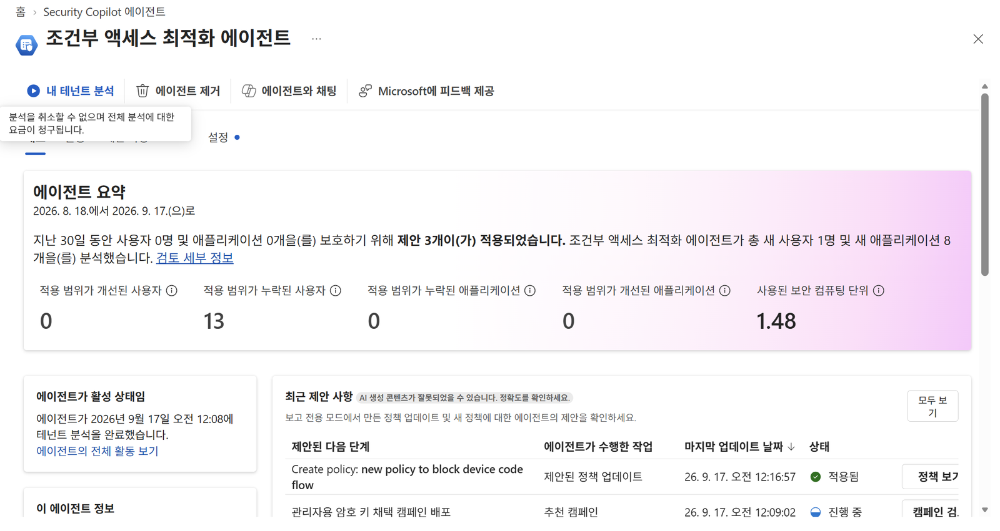
*분석이 끝나면 개요 화면에 요약 지표와 최근 제안 사항이 표시됩니다.*

- 실행 중 **스캔 3단계는 SCU를 소모하지 않습니다** — ① 테넌트의 모든 CA 정책 스캔 ② 정책 갭·통합 가능성 확인 ③ 과거 제안 대조(같은 제안 반복 방지). SCU는 **제안을 생성하는 단계에서만** 소모됩니다.
- 실행 버튼 툴팁에 **"분석을 취소할 수 없으며 전체 분석에 대한 요금이 청구됩니다"**라고 표시됩니다 — 누르기 전에 이 문구를 확인하세요.

### 1-2. 제안 목록 읽는 법
**Overview** 탭의 **Recent suggestions → 모두 보기**로 전체 목록을 엽니다. **에이전트가 수행한 작업** 열로 제안 성격을 먼저 분류하세요.

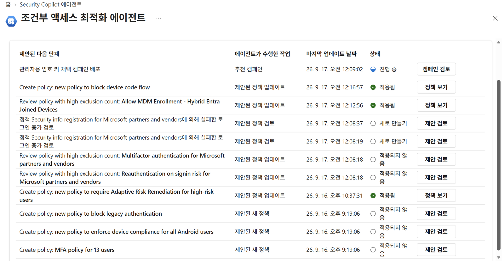
*제안 목록 — "에이전트가 수행한 작업" 열의 값으로 제안 성격을 먼저 분류합니다.*

> [!TIP]
> 제안은 전부 같은 성격이 아닙니다 — **정책 신규 생성 / 기존 정책 수정 / 두 정책 통합 / "이 정책을 검토하라"는 보고서**가 섞여 있습니다. 성격별로 나눠서 봐야 우선순위가 잡힙니다.

### 1-3. 제안 하나 열어 근거 확인

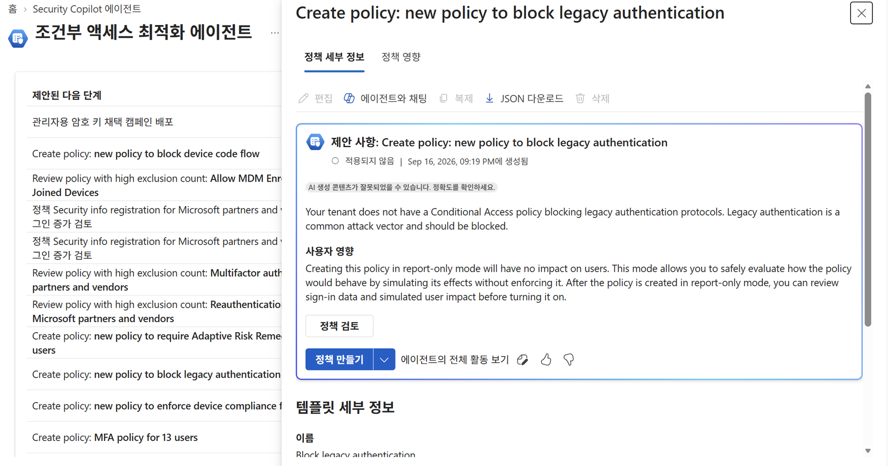
*제안 상세 — 정책 세부 정보와 정책 영향 탭, 사용자 영향 설명을 확인합니다.*

- **사용자 영향** 항목: report-only로 만들면 **사용자에게 아무 영향이 없습니다.** 강제하지 않고 정책 동작을 안전하게 평가한 뒤, 로그인 데이터와 시뮬레이션된 영향을 검토하고 켜면 됩니다.
- **정책 검토**에서 변경 목록과 **정책 전체 JSON diff**를 볼 수 있고, 사용자·앱에 영향이 있는 변경은 **영향 대상 JSON 파일을 다운로드**할 수 있습니다 — 보안팀 검토·변경관리 티켓 첨부용 산출물입니다.

### 1-4. 채팅으로 "이 정책이 정확히 뭔지" 되묻기
제안을 그냥 믿지 말고 **에이전트 채팅으로 되물어보세요.** 영문 제안이라도 **한국어로 물으면 한국어로 설명**해 줍니다. 이 대화형 검증이 에이전트의 핵심 차별점입니다.

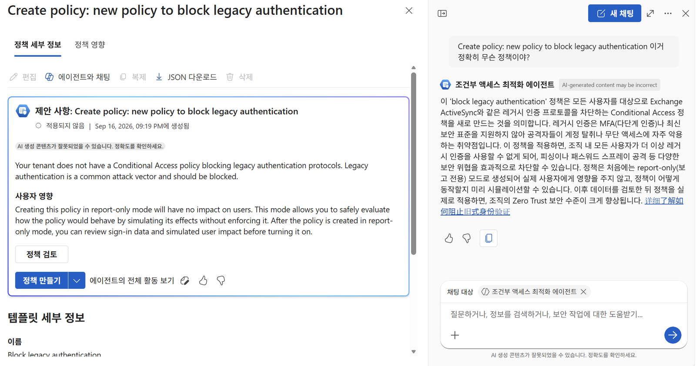
*제안 옆 채팅 패널에서 한국어로 물으면 한국어로 근거를 설명해 줍니다.*

### 1-5. 실제 정책 만들기
`Turn on policy`를 누르면 에이전트가 **report-only 모드로** 정책을 만듭니다. 실제 적용하려면 이후 Conditional Access 정책 목록에서 **Enable policy 토글을 Report-only → On**으로 직접 바꿔야 합니다.

> [!IMPORTANT]
> 여기까지가 에이전트의 역할이고, **On으로 바꾸는 것은 사람의 결정**입니다. 또한 기존 정책에 사용자를 추가하는 제안을 **승인한 사람이, 그 사용자들을 담는 새 그룹의 소유자**가 됩니다 — 조직의 그룹 소유권 정책과 충돌하지 않는지 확인하세요.

참고: [제안 검토](https://learn.microsoft.com/entra/security-copilot/conditional-access-agent-optimization-review-suggestions) · [에이전트 채팅](https://learn.microsoft.com/entra/security-copilot/conditional-access-agent-optimization-chat)

---

## 2단계 — 에이전트 제대로 활용하기

### 2-1. 활동(Activity) — "AI가 무엇을 근거로 판단했나"

활동 맵은 에이전트가 **언제·누가·얼마나 걸려·얼마를 써서** 무엇을 판단했는지 전부 기록으로 남깁니다. 블랙박스가 아니라 감사(audit) 자료가 됩니다.

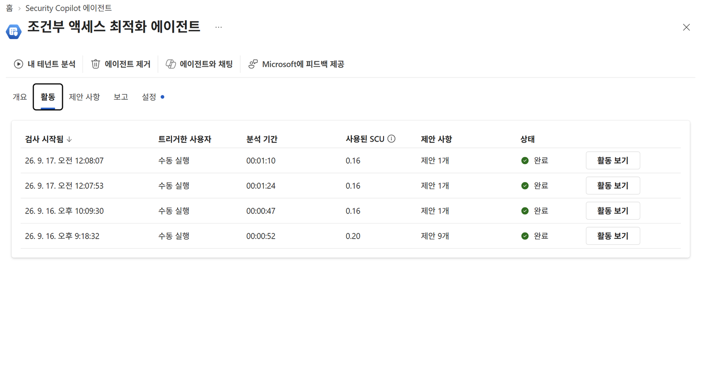
*활동 탭 실행 이력 — 실행당 SCU·분석 기간·트리거한 사용자가 행 단위로 기록됩니다.*

**이 화면이 답해 주는 3가지 질문**
- **비용이 얼마나 드나요?** → 실행당 SCU가 행 단위로 기록됩니다(데모 실측 0.16~0.20 SCU).
- **얼마나 오래 걸리나요?** → 분석 기간 열(이 테넌트는 1분 내외).
- **누가 돌렸나요?** → 트리거한 사용자 열로 수동/자동 실행이 감사 추적됩니다.

> [!TIP]
> 제안 건수는 첫 실행 9개에서 이후 1개로 줄 수 있습니다 — **이전 제안을 대조해 같은 제안을 반복하지 않기 때문**입니다. "0을 찾았다"는 것도 결과입니다("검사를 안 한 게 아니라 검사했더니 없더라"를 기록으로 남김).

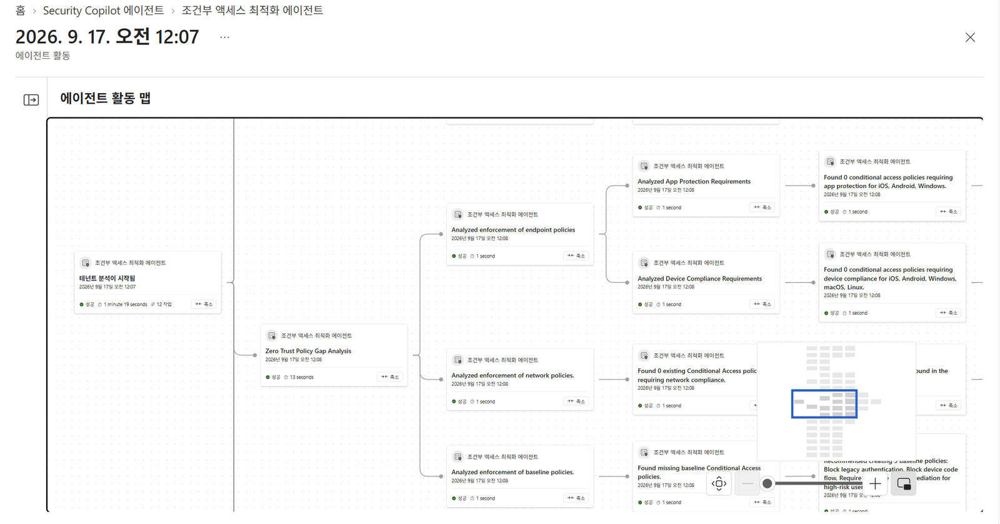
*활동 맵 — "테넌트 분석 시작" 노드에서 각 점검 갈래가 뻗어나갑니다. 각 갈래가 곧 사람이 수동으로도 해야 할 점검 항목입니다.*

**활동 맵의 12개 작업 전체 — 각 갈래 = 내가 수동으로도 점검해야 할 항목**입니다.

| 갈래 (맵 표기) | 실측 소요 | 무엇을 검사하는가 = 점검 기준 |
| --- | :--: | --- |
| **Policy User Drift** | 1초 | 최근 24시간 내 **새로 생긴 사용자**가 기존 정책에 안 잡히는지. 입사·조직이동마다 커버리지 구멍이 생깁니다. |
| **Policy App Drift** | 1초 | 최근 24시간 내 **새로 등록된 앱**이 CA 대상에서 빠졌는지. 현업이 붙인 SaaS가 대표적입니다. |
| **Policy Merge** | 1초 | **동일 grant control**을 가진 정책이 몇 개인지. 조건·컨트롤 차이가 2개 이하면 통합 후보(1회 40쌍까지). |
| **Phased Rollout** | 1초 | report-only 정책 중 **단계적 롤아웃 자격**(all users 대상)이 있는지. 그룹 5개 조건 충족 시 계획 제안. |
| **Deep Policy Analysis** | 8초 | 예외·커버리지 심층 분석. 아래 3개 하위 작업으로 나뉩니다. |
| └ Analyzed break-glass account exclusions | 7초 | **비상 계정이 명시적으로 제외**되어 있는지. 예외 없는 차단 정책은 **잠금 위험**으로 표시. |
| └ Analyzed policy exclusion patterns | 7초 | 권장치보다 **예외가 과도한 정책**. "중첩"의 실체가 보통 여기 있습니다. |
| └ Analyzed MFA policy coverage | 1초 | **MFA 갭 분석**. 활성 + report-only 정책을 모두 평가해 어떤 MFA 정책에도 보호되지 않는 사용자를 산출. |
| **Zero Trust Policy Gap Analysis** | 13초 | Zero Trust 기준 대비 비어 있는 영역. **0건도 명시적 결과**로 기록. 아래 3개 하위 작업. |
| └ Analyzed enforcement of endpoint policies | 1초 | 앱 보호·준수 디바이스를 요구하는 CA가 있는지. **Intune 정책은 있는데 CA가 없는 상태**가 흔합니다. |
| └ Analyzed enforcement of network policies | 1초 | 네트워크 준수·GSA 채널 경유를 요구하는 정책이 있는지. |
| └ Analyzed enforcement of baseline policies | 1초 | 레거시 인증 차단·device code flow 차단 등 **기본 정책 누락**(화면 예시에서 베이스라인 5개 신설 권고). |
| **Analyze CA Policy Impact** | 26초 | 제안 적용 시 **영향받는 사용자·로그인** 산출(제안 상세의 "정책 영향" 탭 데이터). |
| **Policy Naming** | 1초 | 정책 이름이 **조직 명명 규칙**에 맞는지(규칙은 지식 원본 문서에서 읽음). |
| **Policy From Knowledge** | 54초 | 업로드한 **목표 정책 세트**와 현재 정책을 대조 감사(파일 없으면 1초 만에 끝나는 빈 갈래). |
| **LeastPrivilegedAccess** *(Preview)* | 1초 | 에이전트 ID의 **미사용·과다 Graph 권한** 식별 후 최소 권한 권고. |
| **Defender Signal-Informed Analysis** | — | 반복되는 ID 공격이 우리 정책으로 이미 막히는지. 이미 커버되면 제안을 **억제**(제안에 `Linked to Defender` 태그). |
| **Passkey Campaign** | 54초 | **피싱 저항 인증(패스키) 전환 캠페인** 제안(제안 목록에 `추천 캠페인` 유형). |

> [!WARNING]
> **MFA 갭 분석의 알려진 한계** — ① **MFA 갭만** 봅니다(디바이스 준수·레거시 인증 차단 등은 대상 아님). ② **report-only 정책은 커버리지로 인정되지 않습니다** — 유일한 MFA 정책이 report-only면 해당 사용자를 전부 "미보호"로 잡습니다. ③ 미보호 사용자가 100명을 넘으면 전체 건수 + 우선순위 샘플(최근 로그인 순)만 표시. ④ 같은 사용자가 deep analysis와 일반 제안에 중복으로 나타날 수 있습니다.

> [!NOTE]
> **스캔 범위 주의** — 커버리지 갭 탐지는 **최근 24시간**의 신규 사용자·앱·에이전트 ID가 대상이지만, **정책 통합과 deep analysis는 테넌트의 모든 정책**을 평가합니다. 가장 많이 오해하는 지점입니다.

### 2-2. 보고(Reports) — 커버리지 성적표

보고 탭은 **"무엇이 아직 보호되지 않았는가"**를 **사용자 / 앱 / 에이전트 ID** 세 축으로 보여주고 **CSV로 내려받을 수 있습니다.** 제안 목록이 "할 일"이라면, 여기는 **"지금 상태"**입니다.

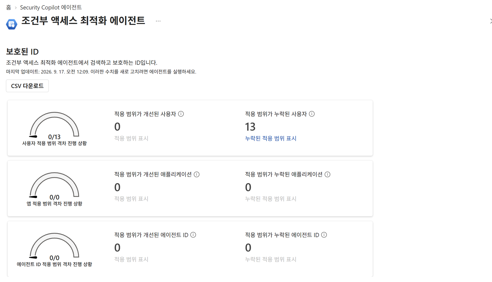
*보고 탭 — 사용자·앱·에이전트 ID 세 축의 커버리지 격차와 CSV 다운로드.*

지표 정의의 핵심은 **"누락된 제어 항목(missing control)"**입니다. 단순 인원 수가 아니라 **MFA·디바이스 준수 같은 컨트롤이 빠진 대상**을 세고, 그중 몇 건이 해소됐는지를 진척도로 보여줍니다.

| 지표 | 정의 (UI 원문) |
| --- | --- |
| **적용 범위가 개선된 사용자** | "하나 이상의 누락된 제어 항목에 대해 적용 범위를 확보한 **중요한 정책 격차**가 있는 사용자입니다." |
| **적용 범위가 개선된 애플리케이션** | "하나 이상의 누락된 제어 항목에 대해 적용 범위를 확보한 **중요한 정책 격차**가 있는 애플리케이션입니다." |
| **적용 범위가 개선된 에이전트 ID** | "하나 이상의 누락된 제어 항목에 대해 적용 범위를 확보한 **중요한 정책 격차**가 있는 에이전트 ID입니다." |

예를 들어 **0/13을 다음에는 13/13으로** 만드는 식으로 진척을 숫자 하나로 추적할 수 있습니다. CSV 다운로드는 보안팀 보고·경영진 리포트에 그대로 쓰는 산출물입니다.

> [!IMPORTANT]
> **수치는 자동 갱신되지 않습니다.** 화면 안내대로 **에이전트를 다시 실행해야 갱신**됩니다("마지막 업데이트: … 이러한 수치를 새로 고치려면 에이전트를 실행하세요."). 정책을 고친 직후 숫자가 그대로여도 정상이며, 다음 실행 후 반영됩니다 — 그래서 **24시간 예약 실행**을 켜 두는 것이 좋습니다.

*(보고 탭은 제품 UI 문구 기준이며, 문서에 있는 "정책 검토 보고서"는 제안 목록에서 여는 별도 기능입니다.)*

### 2-3. 설정(Settings) — 제안 품질을 결정하는 곳

복잡한 환경일수록 여기서 **제안 품질이 갈립니다.** 실제로 값을 넣고 **저장**까지 하세요.

#### ① 트리거(Trigger)

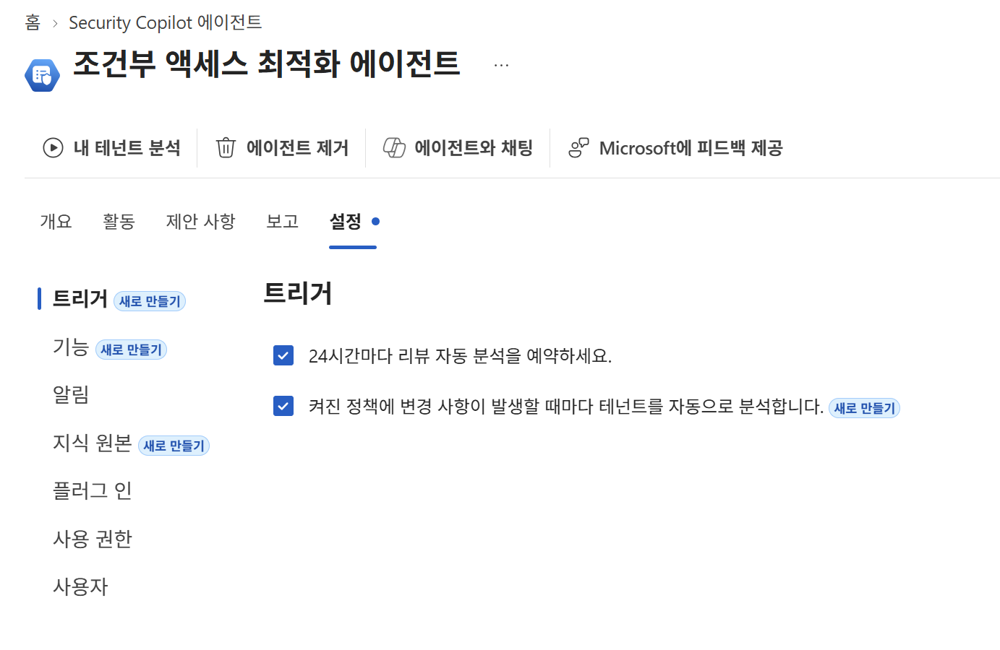
*트리거 설정 — 24시간 예약 실행과 활동 기반 자동 실행(Preview).*

- **예약 실행**: 최초 구성 시점 기준 **24시간마다** 자동 실행(수동 실행 언제든 가능).
- **활동 기반 실행** *(Preview)*: 일일 실행을 대체하지 않고 **추가**됩니다. 트리거 조건 3가지 — ① 활성 정책 수정 ② 정책 상태가 Off·Report-only → On으로 변경 ③ On 상태로 새 정책 생성.
- **감지 주기 / 쿨다운**: **5분마다** 변경을 감지하고, 과다 실행 방지를 위해 실행 사이 **4시간 쿨다운**을 강제합니다.

활동 기반 실행이 실제로 어떻게 동작하는지 — 타임라인 예시:

| 시각 | 이벤트 | 에이전트 동작 |
| --- | --- | --- |
| 0분 | 활성 정책이 수정됨 | 아직 동작 없음 |
| 5분 | 변경 감지 | **실행** |
| 10분 | 또 다른 변경 감지 | 쿨다운 — 실행 안 함 |
| 15분 | 또 다른 변경 감지 | 쿨다운 — 실행 안 함 |
| 4시간 | 쿨다운 만료 | **실행** |

> [!TIP]
> **정리 작업 중에는 활동 기반 실행을 OFF**로 두는 편이 낫습니다(정책 변경이 잦아 노이즈 발생). 표준 정책 세트가 잡힌 뒤 켜면 **drift 감시** 용도로 가장 잘 맞습니다.

#### ② 기능(Capabilities)

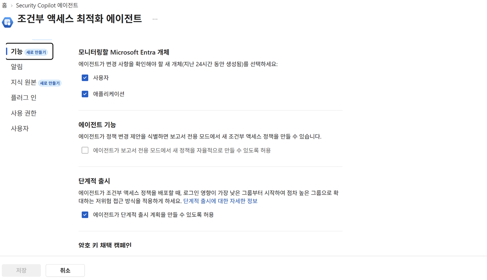
*기능 설정 — 모니터링 대상 개체, 자율 생성 허용(기본 해제), 단계적 출시, 패스키 캠페인.*

- **모니터링할 Entra 개체**: 사용자 / 애플리케이션(둘 다 기본 선택). 노이즈가 많으면 한쪽만 남기세요.
- **에이전트 기능(안전장치)**: "에이전트가 report-only 모드에서 새 정책을 자율 생성하도록 허용"은 **기본 해제**입니다. 즉 **기본 상태에서는 report-only 정책조차 만들지 않고**, 사람이 수동 승인해야 생성됩니다. 켜더라도 **관리자 승인 없이는 정책이 On으로 바뀌지 않습니다.**
- **단계적 출시**: 로그인 영향이 가장 낮은 그룹부터 점진 확대하는 저위험 접근. 기본 사용(자세히는 [4단계](#4단계-에이전트가-만든-정책-배포)).
- **암호 키 채택 캠페인**: 에이전트가 **피싱 방지 인증(패스키) 전환을 대신 운영**합니다.

**암호 키(패스키) 채택 캠페인 — 사용자 준비 상태별 동작(24시간마다 자동)**

| 사용자 준비 상태 | 에이전트가 하는 일 |
| --- | --- |
| **디바이스 업데이트가 필요한 사용자** | 디바이스를 업데이트하라는 **Teams 알림** 발송 · 구성된 유예 기간 동안 미리 알림 반복 |
| **패스키를 설정해야 하는 사용자** | **설정 지침이 담긴 Teams 알림** 발송 · 유예 기간 동안 미리 알림 반복 |
| **적용할 준비가 된 사용자** | 예정된 적용을 알리는 알림 발송 · 유예 기간 종료 시 **피싱 방지 인증을 요구하는 CA 정책 그룹에 사용자 추가**(해당 CA 정책은 **report-only 모드로 생성**) |

#### ③ Teams 알림(Notifications)

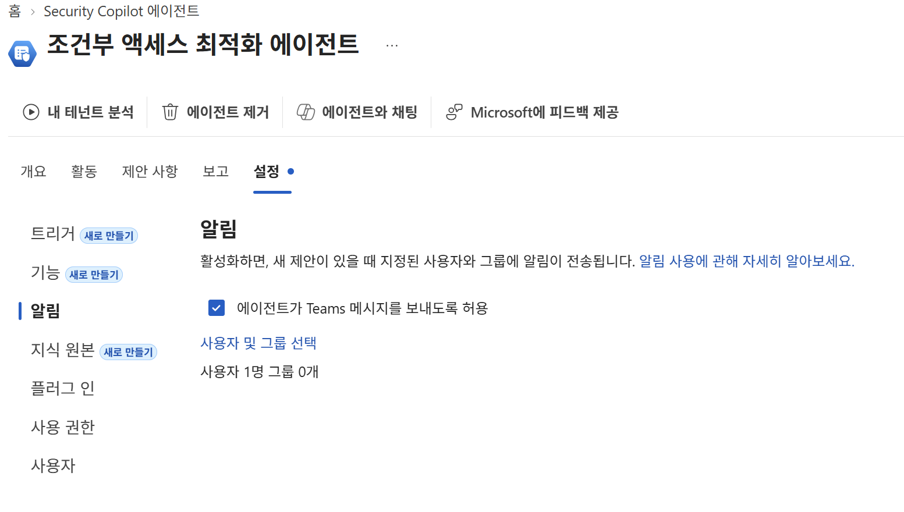
*알림 설정 — 수신자·객체 상한과 단방향(수신 전용) 동작.*

- **인원 제한**: 수신자 **최대 10명**. 그룹 지정 가능하나 **멤버가 10명을 넘으면 그 그룹은 알림을 못 받습니다**(나중에 인원이 추가돼 초과해도 마찬가지).
- **객체 제한**: 알림 대상 **객체 5개**까지(개별 사용자·그룹 조합).
- **단방향**: 수신만 가능하고 Teams에서 **응답·조치 불가**. 메시지의 `Review suggestion`을 누르면 Entra 관리 센터로 이동합니다.

#### ④ 지식 원본(Knowledge sources) + 사용자 지침(Custom instructions) — 차별화 구간

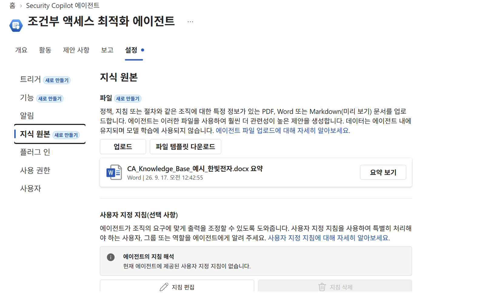
*지식 원본 설정 — 문서 업로드·요약, 사용자 지정 지침 입력.*

문서를 업로드하면 에이전트가 그 내용을 읽어 제안에 반영합니다.

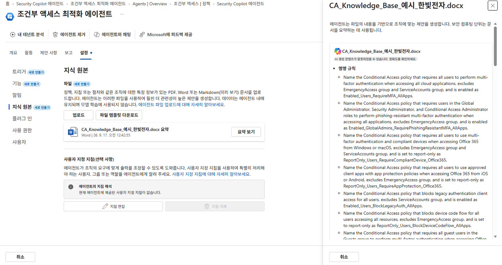
*업로드한 한국어 .docx를 에이전트가 파싱해 이해 요약을 생성합니다(데모 실측: 업로드 → 요약 생성까지 약 10분·0.3 SCU).*

**문서에 넣어야 할 4가지 (템플릿 섹션)**

| 섹션 | 에이전트가 이걸 어디에 쓰는가 |
| --- | --- |
| **페르소나 기반 정책 설계** | 같은 컨트롤(예: MFA)을 강제하는 정책이 여럿일 때 **사용자 페르소나에 맞는 정책을 골라** 수정. "관리 권한 사용자" 같은 추상 표현 대신 **정확한 내장 역할명**을 쓰라고 문서가 명시. |
| **정책 명명 규칙** | ① 새 정책 생성 ② 유사 정책 병합 ③ **정책 이름 변경 권고 생성** |
| **Break-glass 계정 처리** | ① 새 정책 생성 ② **누락된 제외 식별** ③ 기존 정책 수정 권고 |
| **목표(desired) 정책 세트** | 현재 정책을 **목표 상태와 대조 감사**하고, 빠지거나 불완전한 정책을 새 제안으로 올림. 각 항목을 **완결된 지시문**으로 작성. |

**사용자 지침(Custom instructions)** — 이름 또는 Object ID로 입력(그룹 이름을 넣으면 Object ID 자동 채움, 두 값 모두 검증). 용도 3가지 — ① 특정 사용자·그룹·역할 포함/제외 ② 에이전트 **고려 대상에서 아예 제외** ③ 특정 정책에만 예외 적용.

```text
Exclude users in the "Break Glass" group from any policy that requires multifactor authentication.
Exclude user with Object ID dddddddd-3333-4444-5555-eeeeeeeeeeee from all policies.
Exclude the "Guests" group from agent consideration.
Exclude the "Guests" group from any mobile application management policies.
```

> [!TIP]
> **게스트 시나리오** — 게스트가 많으면 에이전트가 신규 게스트를 계속 "미보호 사용자"로 집어내 불필요한 제안·SCU가 발생합니다. `(user.userType -eq "guest")` 동적 그룹 **Guests**를 만들고 → **"Exclude the Guests group from agent consideration."** 지침을 추가하세요.

참고: [에이전트 설정](https://learn.microsoft.com/ko-kr/entra/security-copilot/conditional-access-agent-optimization-settings) · [패스키 캠페인](https://learn.microsoft.com/ko-kr/entra/security-copilot/conditional-access-agent-optimization-passkeys) · [지식 베이스](https://learn.microsoft.com/ko-kr/entra/security-copilot/conditional-access-agent-optimization-knowledge-base)

---

## 3단계 — 기존 정책 분석하기 (Copilot 사이드 패널)

에이전트 화면을 벗어나, **평소 일하는 화면**에서 에이전트를 활용하는 방법입니다. 도구를 하나 더 배우는 게 아니라 **기존 업무에 얹는** 방식입니다.

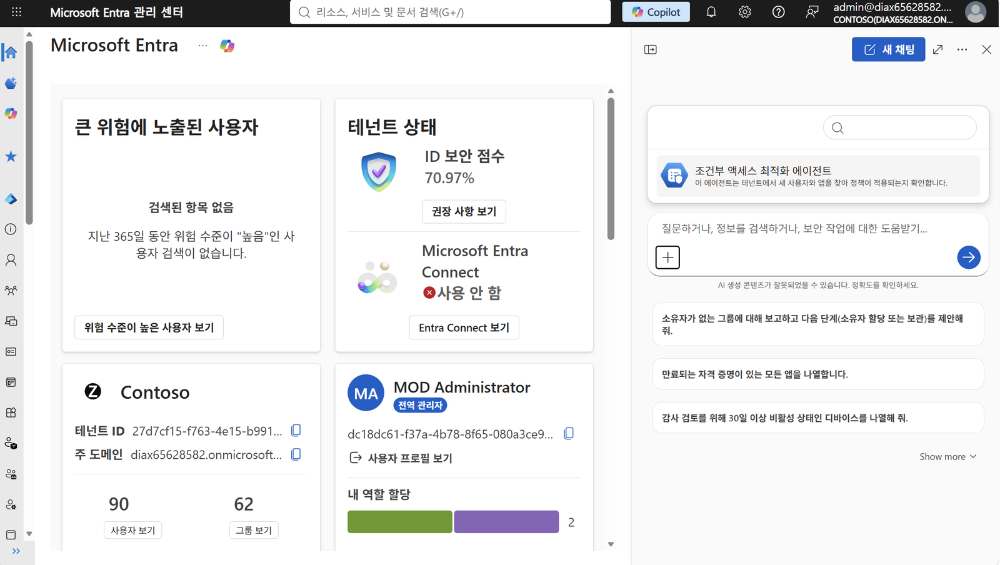
*어느 화면에서든 Copilot 사이드 패널을 열고 대화 대상을 CA 최적화 에이전트로 지정합니다.*

Entra 관리 센터 어느 화면에서든 **Copilot 사이드 패널**을 열고, 대화 대상을 **Conditional Access Optimization Agent**로 지정한 뒤 아래 프롬프트를 그대로 사용하세요.

| 목적 | 프롬프트 (한국어 / 원문) |
| --- | --- |
| **능력 설명** | 이 에이전트로 무엇을 할 수 있나요? *(What can the Conditional Access Optimization Agent help me with?)* |
| **전체 요약** *(여기서 시작)* | 우리 조건부 액세스 진단 결과를 요약해 주세요. *(Summarize my Conditional Access assessment.)* |
| **우선순위** | 어떤 제안부터 적용해야 하나요? *(Which suggestion should I implement first?)* — 영향도를 비교해 **Zero Trust 기준 순위**를 매깁니다. |
| **상세 설명** | 첫 번째 제안에 대해 자세히 설명해 주세요. *(Tell me more about the first suggestion.)* |
| **근거 캐묻기** *(핵심)* | 이 제안에 포함된 12명이 누구인가요? *(Who are the 12 users included in this suggestion?)* / 이 정책을 켜야 하는 이유가 무엇인가요? |
| **판단 이유** | 왜 다른 정책이 아니라 이 정책을 수정 대상으로 골랐나요? |
| **정책 수정** | 이 정책에서 user1을 제외해 주세요. *(Exclude user1 from this policy.)* |
| **롤아웃 확인** | 단계적 롤아웃 제안을 수락하면 어떻게 되나요? |

이어 실제 **Conditional Access 정책 목록** 탭으로 이동해 대조하세요.

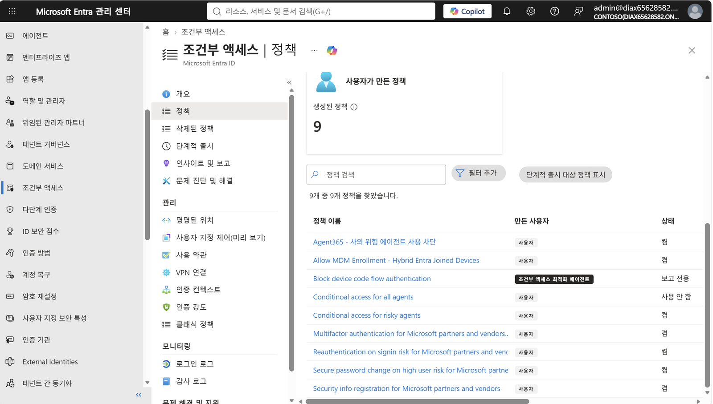
*정책 목록의 "만든 사용자" 열 — 에이전트가 만든 정책에는 전용 배지가 붙어 목록에서 바로 구분됩니다.*

**만든 사용자** 열에서 에이전트가 만든 정책에는 `조건부 액세스 최적화 에이전트` **배지가 붙어**, 누가 만든 정책인지 목록에서 바로 구분됩니다(감사·책임추적). 상단 **"사용자가 만든 정책 / 생성된 정책 N"** 카드로 전체 규모를 파악할 수 있습니다.

> [!NOTE]
> **보고서 전용(Report-only) 모드** — 로그인 시 정책이 **평가는 되지만 강제되지는 않는** 상태입니다. 사용자는 MFA를 요구받지도, 차단되지도 않습니다. 결과는 로그인 로그의 **Conditional Access 탭과 Report-only 탭**에 기록됩니다. *(단, User Actions 범위를 쓰는 항목은 report-only로 평가할 수 없습니다.)*

**report-only 평가 결과 4가지**

| 평가 결과 | 의미 |
| --- | --- |
| **Report-only: Success** | 모든 조건과, 사용자 개입이 필요 없는 grant·session 컨트롤이 충족됨(예: 토큰에 이미 MFA 클레임, 준수 디바이스 확인 통과). |
| **Report-only: Failure** | 조건은 충족됐으나 요구 컨트롤이 미충족(예: 차단 정책 적용, 디바이스 준수 검사 실패). |
| **Report-only: User action required** | 조건은 충족됐고 **사용자 개입이 필요했을** 상황이나, report-only에서는 프롬프트를 띄우지 않음(MFA 챌린지·이용 약관 등). |
| **Report-only: Not applied** | 조건이 모두 충족되지 않음(예: 사용자 제외, 특정 신뢰 위치에만 적용되는 정책). |

참고: [Report-only 모드·정책 영향도](https://learn.microsoft.com/entra/identity/conditional-access/concept-conditional-access-report-only) · [에이전트 채팅](https://learn.microsoft.com/entra/security-copilot/conditional-access-agent-optimization-chat)

---

## 4단계 — 에이전트가 만든 정책 배포

마지막 단계입니다. **"정리는 사람이 설계하고, 배포는 에이전트가 안전하게 밀어준다."**

> [!WARNING]
> **전제 조건** — 롤아웃은 **5단계**로 구성되므로, 테넌트에 **현재 CA 정책에서 사용 중인 그룹이 최소 5개** 있어야 계획이 생성됩니다. 대상은 **모든 사용자(all users)를 대상으로 하는 report-only 정책**이면 자격이 있으며, 에이전트가 만든 정책뿐 아니라 **관리자가 기존에 만든 report-only 정책에도 적용**할 수 있습니다.

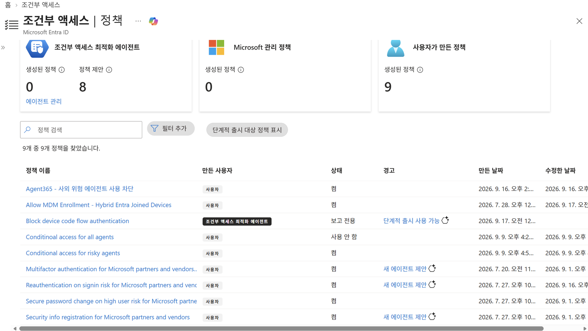
*경고 열에 "단계적 출시 사용 가능 ✨" 링크가 뜬 정책이 롤아웃 대상입니다.*

1. **롤아웃 대상 찾기** — CA 정책 목록의 **경고** 열에 **"단계적 출시 사용 가능" ✨** 링크가 붙은 정책이 대상입니다(화면 예시에서는 에이전트가 만든 `Block device code flow authentication` 정책).
2. **계획 생성·검토** — 정책 패널에서 `Generate plan` → `Review phases` → 필요 시 `Edit Groups`로 각 단계 그룹을 수정. 계획은 **작고 위험 낮은 그룹 → 크고 위험 높은 그룹** 순으로 진행되며, **아직 시작되지 않은 단계의 그룹은 롤아웃 중에도 조정**할 수 있습니다.
3. **안전장치 확인** — 이것이 "락아웃 공포"에 대한 최종 답입니다:
   - 어느 단계에서든 **로그인의 10% 초과가 새 정책에 차단되면 롤아웃이 즉시 일시중지**되고, 실패 원인 보고서와 문제 해결 가이드가 제공됩니다.
   - **성공률이 90% 아래로 떨어지면 롤아웃이 중단되고, 켜졌던 정책이 다시 report-only로 되돌아갑니다.**
   - 롤아웃 시작 후에는 **grant control을 변경할 수 없습니다**(변경하면 롤아웃 취소). 언제든 **일시중지·완료 처리**가 가능하며, 관리자가 그룹 선택·속도·배포를 계속 통제합니다.

> [!TIP]
> **이 단계를 한 문장으로** — "report-only로 관찰하고, 작은 그룹부터 단계적으로 켜고, **10%가 막히면 자동으로 멈추고**, 성공률이 90% 밑이면 **스스로 report-only로 되돌아갑니다.** 수동으로 하면 몇 주 걸리는 배포 계획을 이 구조가 대신합니다."

참고: [단계적 롤아웃 — 전제조건·안전장치·FAQ](https://learn.microsoft.com/entra/security-copilot/conditional-access-agent-optimization-phased-rollout)

---

## 부록 — 즉답용 숫자 & 레퍼런스

| 숫자 | 의미 |
| --- | --- |
| **24시간** | 자동 실행 주기 / 커버리지 갭 스캔 범위(신규 사용자·앱·에이전트 ID) |
| **300명 · 150개** | 1회 실행당 검토 가능한 사용자 수 / 애플리케이션 수 |
| **40쌍 / 2개 이하** | 1회 실행당 평가하는 유사 정책 쌍(통합 후보) / 통합 가능한 조건·컨트롤 차이 한계 |
| **5분 / 4시간** | 활동 기반 실행의 변경 감지 주기 / 실행 쿨다운 |
| **1 SCU 미만** | 실행당 평균 SCU 소모. 단 **최소 1 SCU는 매월 과금**되며 에이전트를 꺼도 중단되지 않음 |
| **0.3 SCU · 약 10분** *(실측)* | 지식 원본 문서 1개 업로드 → 요약본 생성까지 소비 SCU·소요 시간 |
| **0.16~0.20 SCU · 1분 내외** *(실측)* | 테넌트 분석 1회 실행당 소비 SCU·분석 기간 |
| **10명 / 5객체** | Teams 알림 수신자 상한 / 알림 대상 객체 상한 |
| **그룹 5개** | 단계적 롤아웃 계획 생성을 위한 최소 그룹 수 |
| **10% / 90%** | 차단률 10% 초과 시 롤아웃 일시중지 / 성공률 90% 미만 시 report-only로 복귀 |
| **100명** | MFA 갭 분석에서 이 수를 넘으면 전체 건수 + 우선순위 샘플만 표시 |
| **14일** | 제안 Snooze 기간(이후 목록에 다시 나타남) |

## 참고 링크

- [Conditional Access Optimization Agent 개요](https://learn.microsoft.com/entra/security-copilot/conditional-access-agent-optimization)
- [제안 검토 · 활동 맵 · Deep analysis · 정책 검토 보고서](https://learn.microsoft.com/entra/security-copilot/conditional-access-agent-optimization-review-suggestions)
- [에이전트 채팅](https://learn.microsoft.com/entra/security-copilot/conditional-access-agent-optimization-chat)
- [에이전트 설정(트리거·알림·지식 원본·권한)](https://learn.microsoft.com/entra/security-copilot/conditional-access-agent-optimization-settings)
- [단계적 롤아웃](https://learn.microsoft.com/entra/security-copilot/conditional-access-agent-optimization-phased-rollout)
- [Report-only 모드와 정책 영향도](https://learn.microsoft.com/entra/identity/conditional-access/concept-conditional-access-report-only)
- [지식 베이스 작성 가이드(한국어)](https://learn.microsoft.com/ko-kr/entra/security-copilot/conditional-access-agent-optimization-knowledge-base)
- [Passkey 채택 캠페인(한국어)](https://learn.microsoft.com/ko-kr/entra/security-copilot/conditional-access-agent-optimization-passkeys)

---

### 다음 읽을거리

| ◀ 이전 | ▶ 다음 |
| :-- | --: |
| [11 · 핸즈온 랩 1) 위험 조사](./11-handson-lab.md) | [99 · 부록](./99-troubleshooting.md) |

[🏠 전체 목차로 돌아가기](./README.md)
