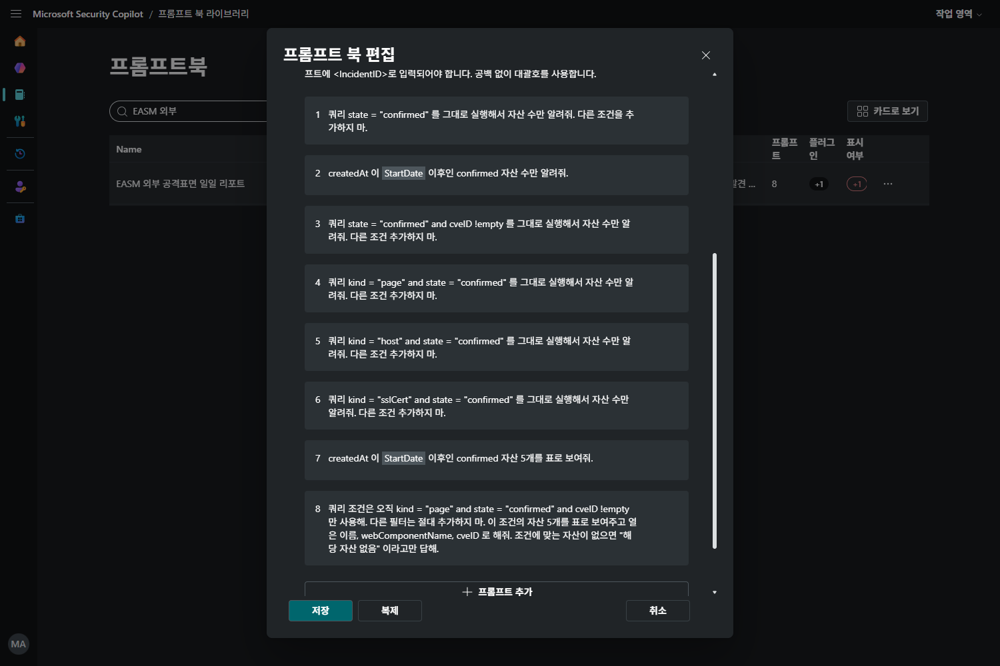
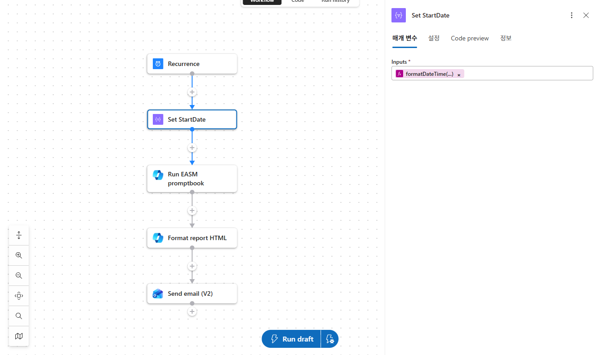
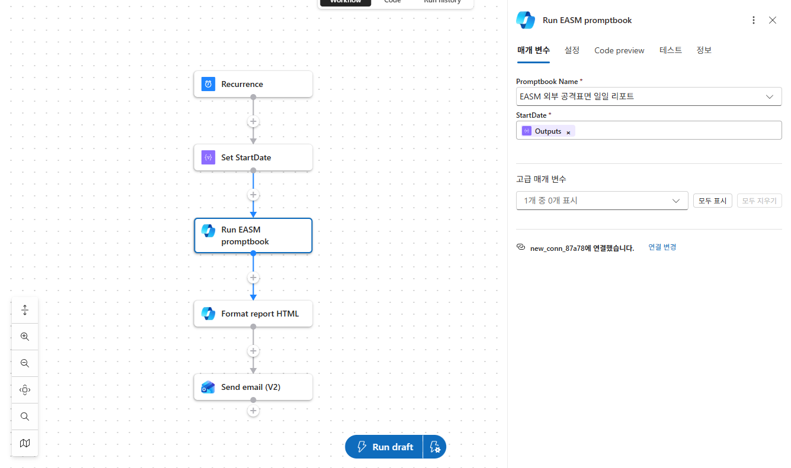
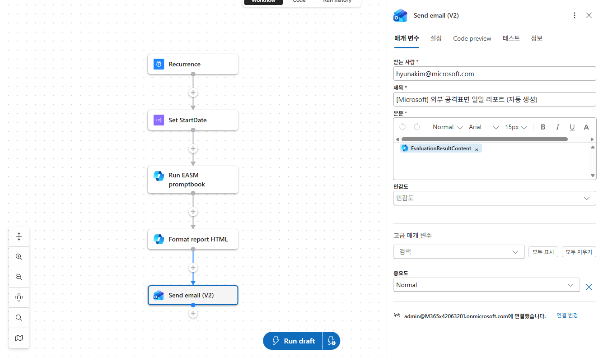

[🏠 전체 목차](./README.md)　·　**Part 4 · 실습·활용**　·　페이지 14 / 15

# 13 · 핸즈온 랩 3) EASM 연동

> [!NOTE]
> **이 페이지에서 얻는 것**
> - Microsoft 공식 **Defender EASM 플러그인**을 Security Copilot에 **직접 연동**하는 전체 절차(연결 → 리소스 설정 → 실행)
> - 플러그인이 제공하는 **8가지 기능(capability)**을 자연어 프롬프트로 호출하는 법 — 한국어/원문 병기
> - **Logic Apps로 리포팅 자동화** — 프롬프트북으로 항목별 실쿼리를 보장하고, 매일 아침 공격면 요약을 디자인된 HTML 메일로 무인 발송(날짜 변수 주입 패턴 포함)
>
> ⏱️ 예상 소요 **40분+**　·　🎯 대상: SOC 분석가 · 위협·취약점 관리(TVM) 담당 · IT/보안 관리자

조직의 방화벽 **바깥**에는 우리가 미처 인지하지 못한 자산이 존재합니다 — 잊힌 테스트 서브도메인, 만료된 인증서, 섀도 IT가 띄운 SaaS, 노출된 포트. **Microsoft Defender External Attack Surface Management(EASM)**는 이 외부 노출면을 지속적으로 발견·매핑하고, **Security Copilot 플러그인**을 통해 그 결과를 자연어로 질의할 수 있게 합니다. 이 랩은 **플러그인을 켜고(1단계) → 실제 프롬프트로 위험을 조사하고(2단계) → 프롬프트북과 Logic Apps로 매일 아침 리포트 메일을 자동 발송(3단계)**하는 과정을 처음부터 끝까지 따라갑니다.

---

## 이 플러그인이 답해 주는 것 — 4가지 핵심 가치

| 가치 | 설명 |
| --- | --- |
| **외부 공격면 스냅샷** | 인터넷에 공개된 정보 + EASM 고유 탐색 알고리즘을 결합해, 호스트·도메인·웹페이지·IP 등 **외부 노출 자산과 그에 딸린 핵심 위험**을 자연어로 요약합니다. |
| **위험 기반 우선순위** | 취약점·인프라 데이터를 분석해 **어떤 자산과 어떤 CVE가 가장 위험한지** 짚고, 권고 조치를 자연어로 설명합니다. |
| **자연어 인사이트 추출** | "안전하지 않은 SSL 인증서 수는?", "열려 있는 포트는?", "이 취약점의 영향 자산은?" 같은 질문을 **KQL·쿼리 문법 없이** 던집니다. |
| **공격면 큐레이션 가속** | 라벨·외부 ID·상태 변경을 자산 집합에 적용해 **인벤토리 정리 속도**를 높입니다. |

---

## 사전 확인 — 이게 안 되면 진행이 막힙니다

시작 전 아래 항목을 먼저 확인하세요.

| 항목 | 필요 조건 |
| --- | --- |
| **Security Copilot 접근** | Security Copilot이 프로비저닝되어 있고 로그인 가능해야 합니다(최소 1 SCU 이상). |
| **플러그인 활성화 권한** | 새 연결을 **활성화(activate)할 권한**이 필요합니다. 개인 범위는 **Contributor**로 충분하지만, 워크스페이스 전체에 켜려면 **Owner**가 **Plugin settings**에서 허용해야 합니다. |
| **EASM 리소스** | 내 조직의 외부 공격면 데이터를 조회하려면 Azure에 **Defender EASM 리소스**가 있어야 합니다. |
| **EASM 데이터 접근** | 로그인한 사용자가 해당 EASM 리소스를 **읽을 수 있는 Azure RBAC 권한**을 보유해야 합니다. |

참고: [EASM–Security Copilot 통합 개요](https://learn.microsoft.com/azure/external-attack-surface-management/easm-copilot) · [EASM Azure 리소스 만들기](https://learn.microsoft.com/azure/external-attack-surface-management/deploying-the-defender-easm-azure-resource)

---

## 1단계 — 플러그인 연동 (연결부터 리소스 설정까지)

**플러그인 켜기 → 내 EASM 리소스 값 입력 → 저장.** 이 3개 동작이 연동의 전부입니다.

### 1-1. 플러그인 켜기

1. [Security Copilot](https://securitycopilot.microsoft.com/)에 접속해 로그인 상태인지 확인합니다.
2. 프롬프트 입력창 하단의 **출처(Sources)** 버튼을 눌러 **원본 관리** 창을 엽니다.
3. **Microsoft** 그룹에서 **Microsoft Defender External Attack Surface Management**를 찾아(검색창에 `Attack Surface` 입력하면 바로 나옵니다) 토글을 **On**으로 켭니다.


*원본 관리 → Microsoft 그룹의 EASM 플러그인을 켭니다. 오른쪽 톱니바퀴로 리소스를 설정합니다.*

> [!TIP]
> Microsoft 플러그인은 **온-비할프(on-behalf-of)** 인증으로 동작합니다 — 별도 API 키·시크릿을 넣지 않아도, 로그인한 사용자의 권한으로 EASM 데이터에 접근합니다. (커스텀 플러그인처럼 앱 등록·시크릿을 만들 필요가 없습니다.)

### 1-2. 내 EASM 리소스 연결 (톱니바퀴 → 설정)

내 조직의 공격면을 조회하려면 플러그인이 **어느 EASM 리소스를 볼지** 알려줘야 합니다. 플러그인 항목 오른쪽의 **톱니바퀴(설정) 아이콘**을 눌러 아래 3개 값을 입력합니다. 값은 모두 **Azure Portal → 해당 Defender EASM 리소스 → 개요(Overview) → 필수(Essentials)**에서 그대로 복사하면 됩니다.


*Azure Portal → EASM 리소스 → 개요 → 필수. 리소스 이름(상단)·리소스 그룹·구독 ID를 여기서 복사합니다.*

| 설정 필드 | 어디서 얻나 (Essentials) | 이 예시의 값 |
| --- | --- | --- |
| **Resource name** | EASM 리소스(워크스페이스) 이름 — 화면 상단 제목 | `EASMdemo` |
| **Subscription ID** | 필수 섹션의 **구독 ID** | `58cbeffb-de96-4722-afd3-…` |
| **Resource group name** | 필수 섹션의 **리소스 그룹** 이름 | `rg-seccop` |


*플러그인 설정 — 3개 필드를 채우고 저장하면 연결이 완료됩니다.*

입력 후 **저장**하면 연결이 완료됩니다. 이제 "내 공격면" 질문에 이 리소스 데이터로 답합니다.

> [!WARNING]
> **연동은 됐는데 다른 플러그인이 물려요** — Copilot은 프롬프트를 보고 플러그인을 **스스로 선택**합니다. EASM가 아닌 다른 플러그인이 응답하면, 프롬프트에 **"Defender EASM"**을 명시하세요(아래 2단계 프롬프트들이 모두 이 패턴을 따릅니다). 응답 하단 **프로세스 로그**를 열면 실제로 어떤 플러그인이 호출됐는지 확인할 수 있습니다.

---

## 2단계 — 실행: 기능별 프롬프트 8종

플러그인은 아래 **8가지 기능**을 제공합니다. 각 기능을 자연어로 호출하는 **한국어/원문 프롬프트**를 그대로 복사해 쓰세요. 모든 프롬프트는 **연결한 내 조직의 EASM 리소스**를 기준으로 조회합니다.


*프롬프트 실행 예시 — EASM 플러그인이 연결된 리소스에서 자산을 집계해 총 자산 수·대표 자산(유형·최초 발견일)을 표로 보여줍니다. 상단 "N개 단계 완료"를 펼치면 어떤 플러그인·스킬이 호출됐는지 확인할 수 있습니다.*

> [!TIP]
> 프롬프트에 **"Defender EASM"**과 자산 이름·CVE ID 같은 **구체적 값**을 넣을수록 정확해집니다. 첫 질문 이후 후속 프롬프트는 같은 리소스 기준으로 이어집니다.

### 2-1. 공격면 요약 (Get attack surface summary)

외부 노출 자산 전반을 자연어로 요약합니다. **여기서 시작하세요.**

> 🇰🇷 "Defender EASM 기준으로 내 외부 공격면을 요약해 줘."
>
> 🇺🇸 *`Get my attack surface according to Defender EASM.`*

### 2-2. 공격면 인사이트 — 우선순위별 (Get attack surface insights)

우선순위(**high/medium/low**)를 지정해 위험 인사이트를 받습니다. 지정하지 않으면 기본값은 **high**입니다.

> 🇰🇷 "Defender EASM에서 내 공격면의 높은 우선순위 인사이트를 알려 줘."
>
> 🇺🇸 *`Get my high-priority attack surface insights from Defender EASM.`*

> 🇰🇷 "내 외부 공격면에 심각한 취약점이 있나요? (Defender EASM)"
>
> 🇺🇸 *`Do I have high-priority vulnerabilities in my external attack surface according to Defender EASM?`*

### 2-3. 특정 CVE의 영향 자산 (Get assets affected by a CVE)

특정 취약점(CVE ID)이 **우리 자산 중 무엇에 영향을 주는지** 찾습니다. 신규 CVE 공시 시 **노출 여부를 즉시 확인**하는 용도입니다.

> 🇰🇷 "Defender EASM에서 CVE-2023-0012의 영향을 받는 내 자산을 알려 줘."
>
> 🇺🇸 *`Which of my assets are affected by CVE-2023-0012 according to Defender EASM?`*

### 2-4. CVSS 점수별 영향 자산 (Get assets affected by a CVSS)

CVSS 심각도(**critical/high/medium/low**)로 영향 자산을 집계합니다. **"위험한 것부터"** 정리할 때 씁니다.

> 🇰🇷 "Defender EASM에서 내 자산 중 CVSS가 critical인 자산은 몇 개이고 어떤 것들인가요?"
>
> 🇺🇸 *`How many of my assets have critical CVSS scores, and which ones? (Defender EASM)`*

### 2-5. 만료된 도메인 (Get expired domains)

만료됐거나 곧 만료될 도메인은 **도메인 탈취·피싱**의 통로가 됩니다.

> 🇰🇷 "Defender EASM 기준으로 내 공격면에서 만료된 도메인은 몇 개인가요?"
>
> 🇺🇸 *`How many domains are expired in my attack surface according to Defender EASM?`*

### 2-6. 만료된 SSL 인증서 (Get expired certificates)

만료 인증서는 **신뢰 경고·중단·중간자 공격** 위험을 만듭니다.

> 🇰🇷 "Defender EASM에서 내 만료된 SSL 인증서를 알려 줘."
>
> 🇺🇸 *`What are my expired SSL certificates according to Defender EASM?`*

### 2-7. SHA-1 인증서 (Get SHA1 certificates)

취약한 **SHA-1 서명** 인증서를 식별해 최신 알고리즘으로 교체 우선순위를 잡습니다.

> 🇰🇷 "Defender EASM 기준으로 내 자산 중 SSL SHA1을 쓰는 인증서는 몇 개인가요?"
>
> 🇺🇸 *`How many of my assets are using SSL SHA1 according to Defender EASM?`*

### 2-8. 자연어 → EASM 쿼리 (Translate natural language to a Defender EASM query)

**가장 강력한 기능.** 임의의 자연어 질문을 EASM 쿼리로 번역해 조건에 맞는 자산을 반환합니다. 포트·기술 스택·등록자 이메일 등 **인벤토리 필터**를 문법 없이 검색합니다.

> 🇰🇷 "내 공격면에서 80번 포트가 열려 있는 호스트를 찾아 줘. (Defender EASM)"
>
> 🇺🇸 *`Get the hosts with port 80 open in my attack surface. (Defender EASM)`*

> 🇰🇷 "jQuery 3.1.0 버전을 사용하는 자산을 모두 찾아 줘. (Defender EASM)"
>
> 🇺🇸 *`What assets are using jQuery version 3.1.0 according to Defender EASM?`*

> 🇰🇷 "등록자 이메일이 name@example.com 인 내 자산을 찾아 줘."
>
> 🇺🇸 *`Which of my assets have a registrant email of name@example.com according to Defender EASM?`*

### 기능 ↔ 프롬프트 한눈에 보기

| # | 기능(capability) | 필수 입력 | 대표 프롬프트(한국어) |
| :--: | --- | --- | --- |
| 1 | 공격면 요약 | — | Defender EASM 기준으로 내 외부 공격면을 요약해 줘. |
| 2 | 공격면 인사이트 | `PriorityLevel`(기본 high) | Defender EASM에서 내 공격면의 높은 우선순위 인사이트를 알려 줘. |
| 3 | CVE 영향 자산 | `CveId` | Defender EASM에서 CVE-2023-0012의 영향을 받는 내 자산을 알려 줘. |
| 4 | CVSS 영향 자산 | `CvssPriority`(critical/high/medium/low) | Defender EASM에서 내 자산 중 CVSS가 critical인 자산을 알려 줘. |
| 5 | 만료 도메인 | — | Defender EASM 기준으로 내 공격면에서 만료된 도메인은 몇 개인가요? |
| 6 | 만료 SSL 인증서 | — | Defender EASM에서 내 만료된 SSL 인증서를 알려 줘. |
| 7 | SHA-1 인증서 | — | Defender EASM 기준으로 내 자산 중 SSL SHA1을 쓰는 인증서는 몇 개인가요? |
| 8 | 자연어→쿼리 | 자연어 질문 | 내 공격면에서 80번 포트가 열려 있는 호스트를 찾아 줘. (Defender EASM) |

---

## 3단계 — 리포팅 자동화 (매일 아침 공격면 요약 메일)

2단계까지는 사용자가 직접 프롬프트를 입력해 답을 받았습니다. 3단계에서는 이 과정을 **프롬프트북 + Azure Logic Apps로 무인 자동화**합니다 — 매일 정해진 시각에 Security Copilot이 EASM 데이터를 조회하고, 그 결과를 **보기 용이한 HTML 리포트**로 변환해 메일로 발송합니다.

### 전체 흐름 — 왜 5개 액션인가


*완성된 워크플로.*

| 순서 | 액션 | 커넥터 | 역할 |
| :--: | --- | --- | --- |
| ① | **Recurrence** | Schedule | 매일 09:00(KST) 트리거 |
| ② | **Set StartDate** | 데이터 작업(작성) | 조회 **기준일을 실행 시점에 계산** |
| ③ | **Run EASM promptbook** | Microsoft Security Copilot | 프롬프트북 8단계를 **각각 실제 쿼리로 실행** |
| ④ | **Format report HTML** | Microsoft Security Copilot | ③의 결과를 **HTML 리포트로 변환** |
| ⑤ | **Send email (V2)** | Office 365 Outlook | ④의 HTML을 메일 본문으로 **발송** |

---

### 3-1. 프롬프트북 만들기 — 리포트의 설계도

Security Copilot 세션에서 **8개 프롬프트를 하나씩 순차 실행**한 뒤, 각 프롬프트 좌측 체크박스를 선택하고 **프롬프트 북 만들기**를 누르면 그 순서 그대로 프롬프트북이 됩니다. 이미 만든 프롬프트북은 **프롬프트북 라이브러리 → ⋯ → 편집**에서 언제든 수정할 수 있습니다.


*프롬프트북 편집 화면. 2번·7번 프롬프트의 회색 칩이 실행 시 값이 주입되는 `StartDate` 변수입니다.*

> [!TIP]
> **날짜는 반드시 변수로 — 모델에게 날짜 계산을 맡기지 마세요.**
> 프롬프트에 "최근 30일"이라고 쓰면 모델이 **학습 시점의 낡은 날짜를 기준으로 계산**해 엉뚱한 수치를 냅니다(예: 실제 119건인데 2년 치를 합산해 1,672건으로 응답). 프롬프트에 `<StartDate>` 처럼 **꺾쇠로 감싼 변수**를 넣으면 실행 시 입력 필드가 생기고, Logic Apps가 매일 계산한 날짜를 주입합니다.

**프롬프트북에 넣을 8개 프롬프트 전문** — 그대로 복사해 사용하세요. 조회 대상 리소스는 1단계에서 설정한 플러그인 설정을 따릅니다.


> 🇰🇷 "쿼리 state = 'confirmed' 를 그대로 실행해서 자산 수만 알려줘. 다른 조건을 추가하지 마."

> 🇰🇷 "createdAt 이 <StartDate> 이후인 confirmed 자산 수만 알려줘."

> 🇰🇷 "쿼리 state = 'confirmed' and cveID !empty 를 그대로 실행해서 자산 수만 알려줘. 다른 조건 추가하지 마."

> 🇰🇷 "쿼리 kind = 'page' and state = 'confirmed' 를 그대로 실행해서 자산 수만 알려줘. 다른 조건 추가하지 마."

> 🇰🇷 "쿼리 kind = 'host' and state = 'confirmed' 를 그대로 실행해서 자산 수만 알려줘. 다른 조건 추가하지 마."

> 🇰🇷 "쿼리 kind = 'sslCert' and state = 'confirmed' 를 그대로 실행해서 자산 수만 알려줘. 다른 조건 추가하지 마."

> 🇰🇷 "createdAt 이 <StartDate> 이후인 confirmed 자산 5개를 표로 보여줘."

> 🇰🇷 "쿼리 조건은 오직 kind = 'page' and state = 'confirmed' and cveID !empty 만 사용해. 다른 필터는 절대 추가하지 마. 이 조건의 자산 5개를 표로 보여주고 열은 이름, webComponentName, cveID 로 해줘. 조건에 맞는 자산이 없으면 해당 자산 없음 이라고만 답해."

#### EASM 스킬이 지원하는 쿼리 문법 — 되는 것과 안 되는 것

프롬프트를 커스터마이즈하기 전에 알아야 할 제약입니다. **지원하지 않는 문법은 오류가 아니라 `0`으로 응답**하기 때문에, 모르면 "자산이 없다"고 오해하게 됩니다.

| 문법 | 지원 | 비고 |
| --- | :--: | --- |
| `state = "confirmed"` · `kind = "page"` (등식) | ✅ | 가장 안정적 |
| `cveID !empty` (값 존재 여부) | ✅ | |
| `createdAt >= "2026-08-23T00:00:00.000Z"` (날짜 범위) | ✅ | **절대 날짜만** |
| `name ~ "dev"` (부분 일치) | ❌ | 조건에 맞는 자산이 있어도 `0` 반환 |
| `invalidAfter` 등 **속성 필드의 범위 비교** | ❌ | SSL 만료일 조회 불가 |
| **정렬(sort)** 지정 | ❌ | 지시를 무시함 |
| **반환 개수** 지정 | ❌ | 요청과 무관하게 **최대 5건** |

---

### 3-2. Recurrence — 발송 시각 설정

**Logic Apps 리소스를 생성**하고, 첫 트리거로 **Recurrence**(일정)를 추가합니다.


*매일 오전 9시 발송 설정.*

| 필드 | 값 | 커스터마이즈 |
| --- | --- | --- |
| **Interval / Frequency** | `1` / `일(Day)` | 주간 리포트는 `1`/`주`, 시간별은 `1`/`시간` |
| **Time zone** | `(UTC+09:00) 서울` | 반드시 지정 — 미지정 시 UTC 기준이라 9시간 밀립니다 |
| **At these hours / minutes** | `9` / `0` | 오후 6시 마감 리포트는 `18`/`0` |

---

### 3-3. Set StartDate — 조회 기준일 자동 계산

**데이터 작업 · 작성(Compose)** 액션을 추가하고 이름을 **Set StartDate**로 변경합니다. 이 액션 하나가 앞서 설명한 **날짜 할루시네이션을 원천 차단**합니다.


*실행 시점마다 "오늘로부터 30일 전"을 ISO 8601 형식으로 계산합니다.*

**Inputs**에 넣을 식:

```text
@{formatDateTime(addDays(utcNow(), -30), 'yyyy-MM-ddTHH:mm:ss.fffZ')}
```

| 부분 | 의미 |
| --- | --- |
| `utcNow()` | 실행 시점의 현재 시각 |
| `addDays(…, -30)` | 30일 전 — **`-7`로 바꾸면 주간 리포트** |
| `formatDateTime(…, 'yyyy-MM-ddTHH:mm:ss.fffZ')` | EASM이 인식하는 ISO 8601 형식으로 변환 |

> [!TIP]
> 실행 기록에서 이 액션의 출력을 열면 `"2026-08-23T09:27:24.904Z"` 처럼 **그날 계산된 실제 날짜**가 보입니다. 리포트 수치가 의심스러울 때 가장 먼저 확인할 지점입니다.

---

### 3-4. Run EASM promptbook — 8개 쿼리 실행

**Microsoft Security Copilot · Run a Security Copilot promptbook** 액션을 추가합니다.


*Promptbook Name을 선택하면 `StartDate` 입력 필드가 자동으로 나타납니다.*

| 필드 | 값 |
| --- | --- |
| **Promptbook Name** | 드롭다운에서 3-1에서 만든 프롬프트북 선택 |
| **StartDate** | **Set StartDate** 액션의 출력 토큰(`Outputs`) |

> [!IMPORTANT]
> `StartDate` 필드는 **프롬프트북에 선언된 변수를 읽어 동적으로 생성**됩니다. 프롬프트북을 먼저 선택해야 이 필드가 나타나며, 변수명을 바꾸면 필드명도 함께 바뀝니다.

---

### 3-5. Format report HTML — 조회 결과를 리포트로 변환

**Submit a Security Copilot prompt** 액션을 추가하고 이름을 **Format report HTML**로 변경합니다. Prompt Content에는 **조회 결과를 HTML 템플릿에 채우는** 변환 프롬프트를 넣고, `<조회결과>` 자리에 앞 액션의 출력을 삽입합니다.


*서식 변환 프롬프트. 조회와 서식을 분리해야 수치 정확도와 디자인을 모두 확보할 수 있습니다.*

프롬프트북 결과를 넘길 때는 **배열을 문자열로 변환**해야 합니다:

```text
@{string(body('Run_EASM_promptbook')?['evaluationResults'])}
```

전체 변환 프롬프트 원문(지시문 + 다크 테마 HTML 템플릿)은 아래에서 내려받아 **Prompt Content에 그대로 붙여넣을 수 있습니다.**

<a href="./assets/13-format-prompt.txt" download="13-format-prompt.txt">📄 전체 변환 프롬프트 원문 내려받기 (.txt)</a>

> [!TIP]
> **디자인을 바꾸는 방법 — HTML 템플릿만 수정하면 됩니다.**
> `<HTML템플릿>`에 넣는 HTML을 교체하면 리포트 외관이 전체적으로 바뀝니다. 이메일 클라이언트(특히 Outlook)는 `<style>` 블록·`class`·`flex` 등을 무시하므로, **모든 스타일을 각 태그에 `style="…"` 인라인으로** 지정하고 **표는 `<table>` + `width` %**로 잡는 것이 안정적입니다.
>
> 데이터가 없을 때 빈 표가 나오지 않도록, 변환 규칙에 **"데이터가 없으면 '해당 항목 없음' 한 줄만 넣어라"**는 지시를 반드시 유지하세요.

---

### 3-6. 메일 발송 — 결과 연결

마지막으로 **Office 365 Outlook · 메일 보내기(V2)** 액션을 추가합니다.


*본문에 앞 서식 액션의 출력 토큰(`EvaluationResultContent`)을 지정합니다.*

| 필드 | 값 |
| --- | --- |
| **받는 사람(To)** | 리포트 수신자 메일 주소 |
| **제목(Subject)** | 예) `[Microsoft] 외부 공격표면 일일 리포트 (자동 생성)` |
| **본문(Body)** | **Format report HTML** 액션의 출력 토큰 `EvaluationResultContent` |

> [!IMPORTANT]
> 본문에는 반드시 **Format report HTML의 출력**을 지정합니다. Run EASM promptbook의 출력을 직접 연결하면 서식이 적용되지 않은 JSON이 그대로 발송됩니다. 또한 메일 본문은 **HTML로 해석**되도록 설정합니다.

---

### 완성된 리포트

저장 후 **Run Trigger**로 즉시 실행하거나 다음 09:00 트리거를 기다리면, 프롬프트북이 조회한 실데이터에 서식이 입혀진 리포트 메일이 수신됩니다. 프롬프트북 8단계를 순차 실행하므로 **완료까지 약 3분**이 걸립니다.


*리포트 구조. 실행 시 각 표에 조회 결과가 채워집니다.*

---

## 참고 링크

- [Microsoft Security Copilot in Defender EASM (공식)](https://learn.microsoft.com/azure/external-attack-surface-management/easm-copilot)
- [Defender EASM Azure 리소스 만들기](https://learn.microsoft.com/azure/external-attack-surface-management/deploying-the-defender-easm-azure-resource)
- [인벤토리 자산 이해](https://learn.microsoft.com/azure/external-attack-surface-management/understanding-inventory-assets)
- [인벤토리 필터 개요](https://learn.microsoft.com/azure/external-attack-surface-management/inventory-filters)
- [Azure Copilot로 공격면 질의(임베디드)](https://learn.microsoft.com/azure/copilot/query-attack-surface)
- [플러그인 관리](https://learn.microsoft.com/security-copilot/manage-plugins) · [프롬프트 팁](https://learn.microsoft.com/security-copilot/prompting-tips)

---

### 다음 읽을거리

| ◀ 이전 | ▶ 다음 |
| :-- | --: |
| [12 · 핸즈온 랩 2) CA 정책 최적화](./12-ca-agent-lab.md) | [99 · 부록](./99-troubleshooting.md) |

[🏠 전체 목차로 돌아가기](./README.md)
