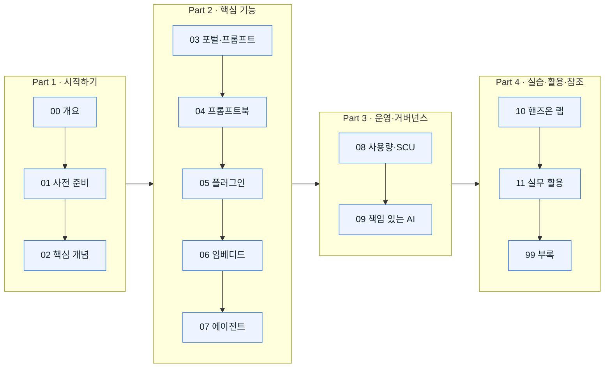

# 🛡️ Microsoft Security Copilot 실전 가이드

**생성형 AI로 보안 운영을 가속하는 방법을, 개념부터 실습까지 한 번에.**

보안팀(SOC 분석가 · 위협 인텔리전스 · IT/보안 관리자 · CISO)이 Microsoft Security Copilot을 *이해하고 → 준비하고 → 직접 써 보도록* 설계한 한국어 학습 코스입니다. 모든 설명은 **Microsoft Learn 공식 문서**를 근거로 하며, 페이지마다 1차 출처를 링크로 남겼습니다.

🌐 **웹사이트로 보기 → https://akimcse.github.io/security-copilot-guide-kr/**

---

## 🚀 어디부터 시작할까요?

읽는 목적에 따라 세 갈래 중 하나로 들어오세요.

- **"Security Copilot이 뭔지 빠르게 감 잡고 싶어요"** → [개요 한 장 보기](./00-overview.md) *(약 6분)*
- **"우리 조직에 도입하려면 뭐가 필요하죠?"** → [사전 준비 · 라이선스 · 권한](./01-prerequisites.md) *(약 9분)*
- **"일단 손으로 만져 보고 싶어요"** → [6단계 핸즈온 랩으로 바로 가기](./10-handson-lab.md) *(약 20분)*
- **"현업에서 어떻게 쓰는지 알고 싶어요"** → [실무 활용 심층 데모 시나리오](./11-use-cases.md) *(약 30분+)*

> [!TIP]
> 처음이라면 위에서 아래로 순서대로 읽는 것을 권장합니다. 각 페이지 상단에 **학습 목표·예상 소요 시간·대상 독자**가 표시되어, 필요한 부분만 골라 읽기에도 좋습니다.

---

## 🗺️ 학습 여정

> [!TIP]
> 위 다이어그램의 각 노드를 클릭하면 해당 페이지로 바로 이동합니다. 

---

## 📚 전체 코스

### Part 1 · 시작하기 — *무엇이고, 무엇이 필요한가*

| 페이지 | 이 페이지의 핵심 | 소요 |
| :-- | :-- | :--: |
| [**00 · 개요**](./00-overview.md) | Security Copilot의 정의, standalone/embedded 두 경험, 동작 파이프라인, 활용 사례 | 6분 |
| [**01 · 사전 준비**](./01-prerequisites.md) | 라이선스(E5/E7 vs SCU), 프로비저닝, Azure 요건, **역할·RBAC 3계층**, 데이터 지역 | 9분 |
| [**02 · 핵심 개념**](./02-concepts.md) | 프롬프트·세션·프롬프트북·플러그인·에이전트·SCU·그라운딩 등 필수 용어 | 7분 |

### Part 2 · 핵심 기능 — *실제로 무엇을 할 수 있는가*

| 페이지 | 이 페이지의 핵심 | 소요 |
| :-- | :-- | :--: |
| [**03 · Standalone 포털**](./03-standalone-portal.md) | 독립형 포털 사용법과 **효과적인 프롬프트 작성 4요소** | 5분 |
| [**04 · 프롬프트북**](./04-promptbooks.md) | 기본 제공 8종 + 나만의 커스텀 프롬프트북 만들기 | 6분 |
| [**05 · 플러그인**](./05-plugins.md) | Microsoft·비-Microsoft·커스텀 플러그인과 접근 제어 | 7분 |
| [**06 · 임베디드 경험**](./06-embedded-experiences.md) | Defender XDR·Entra·Intune·Purview·Sentinel 내장 기능 | 5분 |
| [**07 · 에이전트**](./07-agents.md) | 제품군별 Security Copilot 에이전트 (GA/프리뷰) | 8분 |

### Part 3 · 운영과 거버넌스 — *안전하게 굴리려면*

| 페이지 | 이 페이지의 핵심 | 소요 |
| :-- | :-- | :--: |
| [**08 · 사용량 모니터링**](./08-usage-monitoring.md) | 용량 대시보드, SCU 소비·갱신·한도 동작 | 5분 |
| [**09 · 책임 있는 AI · 데이터 보안**](./09-responsible-ai.md) | 데이터 학습 미사용 보장, 레지던시, 보존, 6대 RAI 원칙 | 8분 |

### Part 4 · 실습과 활용 — *직접 해보고, 현업에 적용하고, 막히면 찾아보기*

| 페이지 | 이 페이지의 핵심 | 소요 |
| :-- | :-- | :--: |
| [**10 · 핸즈온 랩**](./10-handson-lab.md) | 첫 프롬프트 → 프롬프트북 → 플러그인 → 임베디드 → 커스텀 → 에이전트 **6단계 실습** | 20분 |
| [**11 · 실무 활용**](./11-use-cases.md) | 보안팀 페르소나로 따라가는 **심층 데모 시나리오 3가지** (Threat·Identity·Data·운영) + 고급 활용 팁 | 30분+ |
| [**99 · 부록**](./99-troubleshooting.md) | 문제 해결 · FAQ · 알려진 제한 사항 | 참조 |

---

## 🧭 역할별 추천 경로

바쁜 분들을 위해, 역할에 맞춰 꼭 볼 페이지만 골랐습니다.

| 역할 | 추천 순서 | 왜 |
| :-- | :-- | :-- |
| **SOC 분석가 / 위협 헌터** | 00 → 03 → 04 → 06 → 10 → 11 | 프롬프트·프롬프트북·임베디드 조사 흐름, 실습, 실무 시나리오 |
| **보안/IT 관리자** | 01 → 05 → 07 → 08 → 11 → 99 | 도입 요건·플러그인·에이전트·용량 관리·운영 베스트 프랙티스·트러블슈팅 |
| **컴플라이언스 / 데이터 보호** | 00 → 09 → 06 → 11 → 01 | 데이터 처리·레지던시, Purview 임베디드, DLP·IRM 실무 시나리오 |
| **CISO / 의사결정자** | 00 → 09 → 07 → 08 | 가치·거버넌스·자동화·비용(SCU)을 큰 그림으로 |

---

## 🔑 자주 쓰는 포털

| 포털 | URL | 용도 |
| :-- | :-- | :-- |
| Security Copilot 포털 | https://securitycopilot.microsoft.com/ | 독립형 경험(프롬프트·프롬프트북·에이전트·플러그인) |
| Security Store | https://securitystore.microsoft.com/ | 에이전트·솔루션 검색·설치 |
| Microsoft Defender 포털 | https://security.microsoft.com/ | Defender XDR 임베디드(인시던트 요약·유도된 대응·KQL) |
| Microsoft Entra 관리 센터 | https://entra.microsoft.com/ | Entra 임베디드·조건부 액세스 최적화 에이전트 |
| Microsoft Intune 관리 센터 | https://intune.microsoft.com/ | Intune 임베디드·에이전트 |
| Microsoft Purview 포털 | https://purview.microsoft.com/ | Purview 임베디드(DLP·IRM) |
| Azure 포털 | https://portal.azure.com/ | SCU 용량 프로비저닝·관리 |

---

## ❓ 시작 전 짚고 갈 3가지

> [!IMPORTANT]
> - **라이선스부터 확인하세요.** Microsoft 365 E5/E7 보유 여부에 따라 온보딩 절차와 SCU 구매 필요성이 달라집니다. → [01 사전 준비](./01-prerequisites.md)
> - **프리뷰 기능이 많습니다.** UI·사양·제공 조건이 바뀔 수 있으니, 실습 전 각 페이지의 **참고 링크**에서 최신 상태를 확인하세요. (공개 프리뷰 기능도 SCU가 과금됩니다.)
> - **상용 클라우드 전용입니다.** GCC / GCC High / DoD / Azure Government 환경에서는 사용하도록 설계되지 않았습니다.

---

## 📎 이 코스에 대하여

- **근거:** 모든 내용은 [Microsoft Learn](https://learn.microsoft.com/security-copilot/) 공식 문서를 기반으로 하며, 각 페이지 하단 **참고 링크**에 1차 출처를 명시했습니다.
- **성격:** 학습용 비공식 자료입니다. Microsoft, Microsoft Security Copilot 및 관련 제품명은 Microsoft Corporation의 상표입니다.

**준비됐나요? → [00 · 개요부터 시작하기](./00-overview.md)**

